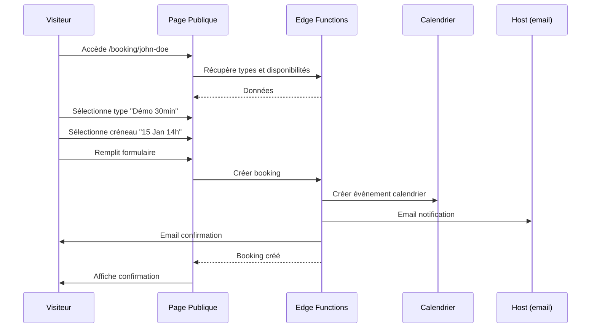

# Guide Technique - Module Booking (RDV Public)

> **Version**: 1.9.0 | **Dernière mise à jour**: Mars 2026

## Table des Matières

- [Vue d'ensemble](#vue-densemble)
- [Architecture](#architecture)
- [Composants](#composants)
- [Hooks](#hooks)
- [Tables de Base de Données](#tables-de-base-de-données)
- [Edge Functions](#edge-functions)
- [Pages Publiques](#pages-publiques)

---

## Vue d'ensemble

Le module Booking permet la prise de RDV en ligne :

| Fonctionnalité | Description |
|----------------|-------------|
| **Pages publiques** | Liens partageables pour prise de RDV |
| **Types de RDV** | Démo, formation, support, etc. |
| **Disponibilités** | Créneaux configurables par utilisateur |
| **Confirmations** | Emails automatiques |
| **Rappels** | Notifications 24h et 1h avant |
| **Calendrier** | Intégration calendrier OpenPulse |

---

## Architecture

```
┌─────────────────────────────────────────────────────────────┐
│                      BOOKING MODULE                          │
├─────────────────────────────────────────────────────────────┤
│  Routes:                                                     │
│  - /booking/:slug (PUBLIC)                                   │
│  - /parametres/booking (ADMIN)                               │
├─────────────────────────────────────────────────────────────┤
│                                                              │
│  ┌─────────────────────────────────────────────────────┐    │
│  │                  Page Publique                        │    │
│  │  ┌─────────┐  ┌─────────┐  ┌─────────┐             │    │
│  │  │ Types   │→→│ Créneaux │→→│ Confirm │             │    │
│  │  │  RDV    │  │  dispo   │  │  ation  │             │    │
│  │  └─────────┘  └─────────┘  └─────────┘             │    │
│  └─────────────────────────────────────────────────────┘    │
│                          │                                   │
│                          ▼                                   │
│  ┌─────────────────────────────────────────────────────┐    │
│  │                    bookings                          │    │
│  │  • Informations invité                               │    │
│  │  • Créneau sélectionné                              │    │
│  │  • Liaison calendrier                                │    │
│  └─────────────────────────────────────────────────────┘    │
│                          │                                   │
│         ┌────────────────┼────────────────┐                 │
│         ▼                ▼                ▼                 │
│  ┌───────────┐  ┌───────────────┐  ┌───────────────┐       │
│  │ Email     │  │   Calendrier   │  │   Rappels     │       │
│  │ confirm   │  │   (event)      │  │   (CRON)      │       │
│  └───────────┘  └───────────────┘  └───────────────┘       │
└─────────────────────────────────────────────────────────────┘
```

---

## Composants

### Composants Admin (`src/components/booking/`)

| Composant | Description |
|-----------|-------------|
| `BookingPagesManager.tsx` | Gestion des pages de booking |
| `BookingPageForm.tsx` | Création/édition page |
| `BookingTypesManager.tsx` | Types de RDV |
| `AvailabilityEditor.tsx` | Édition disponibilités |
| `BookingsCalendar.tsx` | Vue calendrier des RDV |
| `BookingsList.tsx` | Liste des réservations |

### Composants Publics (`src/pages/PublicBooking.tsx`)

| Composant | Description |
|-----------|-------------|
| `BookingTypeSelector.tsx` | Choix du type de RDV |
| `SlotPicker.tsx` | Sélection créneau |
| `BookingForm.tsx` | Formulaire invité |
| `BookingConfirmation.tsx` | Page de confirmation |

---

## Hooks

| Hook | Description |
|------|-------------|
| `useBookingPages` | CRUD pages de booking |
| `useBookingTypes` | Types de RDV |
| `useBookings` | Réservations |
| `useAvailabilitySlots` | Créneaux disponibles |
| `usePublicBooking` | Données page publique |

### Exemple d'utilisation

```typescript
import { useAvailabilitySlots, usePublicBooking } from '@/hooks/booking';

function SlotPicker({ pageSlug, typeId, date }: Props) {
  const { data: page } = usePublicBooking(pageSlug);
  
  const { 
    data: slots, 
    isLoading 
  } = useAvailabilitySlots({
    hostUserId: page?.user_id,
    bookingTypeId: typeId,
    date
  });

  return (
    <div className="grid grid-cols-3 gap-2">
      {slots?.map(slot => (
        <Button 
          key={slot.time}
          variant={slot.available ? 'outline' : 'ghost'}
          disabled={!slot.available}
        >
          {slot.time}
        </Button>
      ))}
    </div>
  );
}
```

---

## Tables de Base de Données

### `booking_pages`

```sql
CREATE TABLE booking_pages (
  id UUID PRIMARY KEY DEFAULT gen_random_uuid(),
  user_id UUID REFERENCES profiles NOT NULL,
  
  -- Identifiant public
  slug TEXT UNIQUE NOT NULL,
  
  -- Personnalisation
  title TEXT NOT NULL,
  description TEXT,
  welcome_message TEXT,
  
  -- Branding
  logo_url TEXT,
  cover_image_url TEXT,
  theme_color TEXT DEFAULT '#3B82F6',
  
  -- Paramètres
  timezone TEXT DEFAULT 'Europe/Paris',
  require_phone BOOLEAN DEFAULT false,
  require_company BOOLEAN DEFAULT false,
  
  -- Questions personnalisées
  custom_questions JSONB DEFAULT '[]',
  
  -- Redirection après booking
  success_redirect_url TEXT,
  
  is_active BOOLEAN DEFAULT true,
  
  created_at TIMESTAMPTZ DEFAULT now(),
  updated_at TIMESTAMPTZ DEFAULT now()
);
```

### `booking_types`

```sql
CREATE TABLE booking_types (
  id UUID PRIMARY KEY DEFAULT gen_random_uuid(),
  
  name TEXT NOT NULL,
  description TEXT,
  
  -- Durée
  duration_minutes INTEGER DEFAULT 30,
  
  -- Buffers
  buffer_before_minutes INTEGER DEFAULT 0,
  buffer_after_minutes INTEGER DEFAULT 15,
  
  -- Contraintes
  min_notice_hours INTEGER DEFAULT 24,
  max_future_days INTEGER DEFAULT 60,
  
  -- Visio
  location_type TEXT DEFAULT 'video', -- video, phone, in_person
  video_provider TEXT, -- google_meet, zoom, teams
  
  -- Catégorie
  category TEXT DEFAULT 'meeting',
  color TEXT,
  
  -- Approbation requise
  requires_approval BOOLEAN DEFAULT false,
  
  is_active BOOLEAN DEFAULT true,
  created_by UUID REFERENCES profiles,
  
  created_at TIMESTAMPTZ DEFAULT now(),
  updated_at TIMESTAMPTZ DEFAULT now()
);
```

### `booking_availability_slots`

```sql
CREATE TABLE booking_availability_slots (
  id UUID PRIMARY KEY DEFAULT gen_random_uuid(),
  user_id UUID REFERENCES profiles NOT NULL,
  booking_type_id UUID REFERENCES booking_types,
  
  -- Jour de la semaine (0=Dimanche, 1=Lundi...)
  day_of_week INTEGER NOT NULL CHECK (day_of_week BETWEEN 0 AND 6),
  
  start_time TIME NOT NULL,
  end_time TIME NOT NULL,
  
  is_active BOOLEAN DEFAULT true,
  
  created_at TIMESTAMPTZ DEFAULT now(),
  updated_at TIMESTAMPTZ DEFAULT now()
);
```

### `booking_exceptions`

```sql
CREATE TABLE booking_exceptions (
  id UUID PRIMARY KEY DEFAULT gen_random_uuid(),
  user_id UUID REFERENCES profiles NOT NULL,
  
  date DATE NOT NULL,
  
  -- Indisponible tout le jour ou créneau spécifique
  is_available BOOLEAN DEFAULT false,
  start_time TIME,
  end_time TIME,
  
  reason TEXT,
  
  created_at TIMESTAMPTZ DEFAULT now()
);
```

### `bookings`

```sql
CREATE TABLE bookings (
  id UUID PRIMARY KEY DEFAULT gen_random_uuid(),
  
  booking_page_id UUID REFERENCES booking_pages,
  booking_type_id UUID REFERENCES booking_types NOT NULL,
  host_user_id UUID REFERENCES profiles NOT NULL,
  
  -- Créneau
  start_time TIMESTAMPTZ NOT NULL,
  end_time TIMESTAMPTZ NOT NULL,
  timezone TEXT,
  
  -- Invité
  guest_name TEXT NOT NULL,
  guest_email TEXT NOT NULL,
  guest_phone TEXT,
  guest_company TEXT,
  guest_notes TEXT,
  
  -- Réponses personnalisées
  custom_answers JSONB,
  
  -- Localisation
  location TEXT,
  video_conference_url TEXT,
  
  -- Statut
  status TEXT DEFAULT 'confirmed', -- pending, confirmed, cancelled, completed
  
  -- Annulation
  cancelled_at TIMESTAMPTZ,
  cancelled_by TEXT, -- host, guest
  cancellation_reason TEXT,
  
  -- Confirmation
  confirmation_token TEXT UNIQUE,
  confirmed_at TIMESTAMPTZ,
  
  -- Rappels
  reminder_sent_24h BOOLEAN DEFAULT false,
  reminder_sent_1h BOOLEAN DEFAULT false,
  
  -- Liaison calendrier
  calendar_event_id UUID REFERENCES calendar_events,
  
  -- Liaison établissement (optionnel)
  etablissement_id UUID REFERENCES etablissements,
  tache_id UUID REFERENCES taches,
  
  -- Tracking
  source TEXT,
  referrer TEXT,
  ip_address INET,
  user_agent TEXT,
  
  created_at TIMESTAMPTZ DEFAULT now(),
  updated_at TIMESTAMPTZ DEFAULT now()
);
```

---

## Edge Functions

### `send-booking-confirmation`

Envoie l'email de confirmation.

```typescript
POST /functions/v1/send-booking-confirmation
{
  "bookingId": "uuid"
}

// Response
{
  "success": true,
  "emailSent": true
}
```

**Contenu de l'email** :
- Détails du RDV (date, heure, durée)
- Lien de visioconférence
- Bouton "Ajouter au calendrier" (.ics)
- Lien d'annulation

### `send-booking-reminder`

Envoie les rappels (CRON).

```typescript
// Déclenché par CRON toutes les heures
POST /functions/v1/send-booking-reminder

// Response
{
  "success": true,
  "reminders24h": 5,
  "reminders1h": 2
}
```

### `cancel-booking`

Annulation d'un RDV.

```typescript
POST /functions/v1/cancel-booking
{
  "bookingId": "uuid",
  "cancelledBy": "guest",
  "reason": "Empêchement"
}
```

---

## Pages Publiques

### Route Publique

```tsx
// src/pages/PublicBooking.tsx
// Route: /booking/:slug

function PublicBooking() {
  const { slug } = useParams();
  const { data: page, isLoading } = usePublicBooking(slug);
  
  const [step, setStep] = useState<'type' | 'slot' | 'form' | 'confirm'>('type');
  const [selectedType, setSelectedType] = useState<string>();
  const [selectedSlot, setSelectedSlot] = useState<Date>();
  
  if (!page?.is_active) {
    return <NotFound />;
  }

  return (
    <div className="min-h-screen bg-background">
      <BookingHeader page={page} />
      
      {step === 'type' && (
        <BookingTypeSelector 
          pageId={page.id}
          onSelect={(typeId) => {
            setSelectedType(typeId);
            setStep('slot');
          }}
        />
      )}
      
      {step === 'slot' && (
        <SlotPicker
          hostUserId={page.user_id}
          typeId={selectedType!}
          onSelect={(slot) => {
            setSelectedSlot(slot);
            setStep('form');
          }}
          onBack={() => setStep('type')}
        />
      )}
      
      {step === 'form' && (
        <BookingForm
          page={page}
          typeId={selectedType!}
          slot={selectedSlot!}
          onSubmit={handleBooking}
          onBack={() => setStep('slot')}
        />
      )}
      
      {step === 'confirm' && (
        <BookingConfirmation booking={createdBooking} />
      )}
    </div>
  );
}
```

### Calcul des Créneaux Disponibles

```typescript
// src/lib/booking/availability.ts

export function calculateAvailableSlots(
  date: Date,
  hostUserId: string,
  bookingType: BookingType,
  existingBookings: Booking[],
  availabilitySlots: AvailabilitySlot[],
  exceptions: BookingException[]
): TimeSlot[] {
  const dayOfWeek = date.getDay();
  
  // 1. Vérifier les exceptions (jour férié, congé)
  const exception = exceptions.find(e => isSameDay(e.date, date));
  if (exception && !exception.is_available) {
    return [];
  }
  
  // 2. Récupérer les créneaux du jour
  const daySlots = availabilitySlots.filter(
    s => s.day_of_week === dayOfWeek && s.is_active
  );
  
  // 3. Générer les créneaux possibles
  const slots: TimeSlot[] = [];
  
  for (const slot of daySlots) {
    let current = parseTime(slot.start_time);
    const end = parseTime(slot.end_time);
    
    while (current < end) {
      const slotEnd = addMinutes(current, bookingType.duration_minutes);
      
      // Vérifier si le créneau est libre
      const isBooked = existingBookings.some(
        b => isOverlapping(current, slotEnd, b.start_time, b.end_time)
      );
      
      // Vérifier le préavis minimum
      const now = new Date();
      const minNotice = addHours(now, bookingType.min_notice_hours);
      const isTooSoon = current < minNotice;
      
      slots.push({
        time: format(current, 'HH:mm'),
        available: !isBooked && !isTooSoon
      });
      
      current = addMinutes(current, 30); // Intervalle de 30 min
    }
  }
  
  return slots;
}
```

---

## Workflow Booking



---

*Documentation mise à jour en mars 2026 — v1.9.0*
