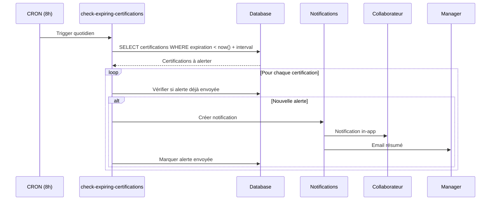

# Guide Technique - Module Compétences & Certifications

> **Version**: 1.9.0 | **Dernière mise à jour**: Mars 2026

## Table des Matières

- [Vue d'ensemble](#vue-densemble)
- [Architecture](#architecture)
- [Composants](#composants)
- [Hooks](#hooks)
- [Tables de Base de Données](#tables-de-base-de-données)
- [Edge Functions](#edge-functions)
- [Alertes Expiration](#alertes-expiration)

---

## Vue d'ensemble

Le module Compétences gère les compétences et certifications des collaborateurs :

| Fonctionnalité | Description |
|----------------|-------------|
| **Référentiel** | Catalogue de compétences de l'entreprise |
| **Évaluation** | Niveaux de maîtrise par collaborateur |
| **Certifications** | Suivi des certifications avec dates d'expiration |
| **Alertes** | Notifications avant expiration |
| **Plans de développement** | Objectifs de montée en compétence |
| **Matching** | Adéquation compétences/besoins projet |

---

## Architecture

```
┌─────────────────────────────────────────────────────────────┐
│                   COMPETENCES MODULE                         │
├─────────────────────────────────────────────────────────────┤
│  Routes: /people (onglet Compétences), /competences          │
├─────────────────────────────────────────────────────────────┤
│                                                              │
│  ┌─────────────┐  ┌─────────────┐  ┌─────────────┐         │
│  │ Référentiel │  │ Compétences │  │Certifications│        │
│  │  Entreprise │  │ Collaborateur│  │   Suivi     │         │
│  └─────────────┘  └─────────────┘  └─────────────┘         │
│         │                │                │                  │
│         ▼                ▼                ▼                  │
│  ┌─────────────────────────────────────────────────────┐   │
│  │                Matrice des Compétences                │   │
│  │  Collaborateurs x Compétences = Niveaux de Maîtrise  │   │
│  └─────────────────────────────────────────────────────┘   │
│                          │                                   │
│         ┌────────────────┼────────────────┐                 │
│         ▼                ▼                ▼                 │
│  ┌───────────┐  ┌───────────────┐  ┌───────────────┐       │
│  │  Alertes  │  │     Plans     │  │   Matching    │       │
│  │ Expiration│  │ Développement │  │   Projets     │       │
│  └───────────┘  └───────────────┘  └───────────────┘       │
└─────────────────────────────────────────────────────────────┘
```

---

## Composants

### Composants Principaux (`src/components/competences/`)

| Composant | Description |
|-----------|-------------|
| `CompetencesDashboard.tsx` | Vue d'ensemble compétences équipe |
| `ReferentielManager.tsx` | Gestion du catalogue compétences |
| `CompetenceForm.tsx` | Création/édition compétence |
| `EmployeeCompetences.tsx` | Compétences d'un collaborateur |
| `CompetenceEvaluationForm.tsx` | Évaluation niveau |
| `CertificationsList.tsx` | Liste certifications |
| `CertificationForm.tsx` | Ajout certification |
| `ExpirationAlerts.tsx` | Alertes certifications |
| `CompetenceMatrix.tsx` | Matrice visuelle équipe |
| `PlanDeveloppement.tsx` | Plan de progression |
| `SkillGap.tsx` | Analyse des écarts |

### Composants People

Intégration dans le module People :

```tsx
// src/pages/People.tsx
<Tabs>
  <TabsList>
    <TabsTrigger value="overview">Vue d'ensemble</TabsTrigger>
    <TabsTrigger value="dossiers">Dossiers RH</TabsTrigger>
    <TabsTrigger value="competences">Compétences</TabsTrigger>
    {/* ... */}
  </TabsList>
  
  <TabsContent value="competences">
    <CompetencesDashboard />
  </TabsContent>
</Tabs>
```

---

## Hooks

| Hook | Description |
|------|-------------|
| `useReferentielCompetences` | CRUD référentiel |
| `useEmployeeCompetences` | Compétences d'un collaborateur |
| `useCertifications` | CRUD certifications |
| `useCompetenceMatrix` | Matrice équipe |
| `useExpiringCertifications` | Alertes expiration |
| `usePlansDeveloppement` | Plans de progression |

### Exemple d'utilisation

```typescript
import { useEmployeeCompetences, useCertifications } from '@/hooks/competences';

function EmployeeSkillsTab({ employeeId }: { employeeId: string }) {
  const { 
    data: competences, 
    evaluateCompetence 
  } = useEmployeeCompetences(employeeId);
  
  const { 
    data: certifications,
    expiringCount 
  } = useCertifications(employeeId);

  const handleEvaluate = async (competenceId: string, niveau: number) => {
    await evaluateCompetence.mutateAsync({
      competenceId,
      niveau,
      evaluateurId: currentUserId
    });
  };

  return (
    <div className="space-y-6">
      {expiringCount > 0 && (
        <Alert variant="warning">
          {expiringCount} certification(s) expire(nt) dans les 90 jours
        </Alert>
      )}
      
      <CompetencesList 
        competences={competences}
        onEvaluate={handleEvaluate}
      />
      
      <CertificationsList certifications={certifications} />
    </div>
  );
}
```

---

## Tables de Base de Données

### `referentiel_competences`

```sql
CREATE TABLE referentiel_competences (
  id UUID PRIMARY KEY DEFAULT gen_random_uuid(),
  
  nom TEXT NOT NULL,
  description TEXT,
  
  -- Catégorie
  categorie TEXT NOT NULL, -- technique, metier, soft_skill, langue, outil
  sous_categorie TEXT,
  
  -- Niveaux de maîtrise
  niveaux JSONB DEFAULT '[
    {"niveau": 1, "label": "Débutant", "description": "Connaissance de base"},
    {"niveau": 2, "label": "Intermédiaire", "description": "Pratique autonome"},
    {"niveau": 3, "label": "Avancé", "description": "Expertise confirmée"},
    {"niveau": 4, "label": "Expert", "description": "Référent interne"},
    {"niveau": 5, "label": "Maître", "description": "Référent externe"}
  ]',
  
  -- Métadonnées
  obligatoire BOOLEAN DEFAULT false,
  icone TEXT, -- Lucide icon
  couleur TEXT,
  
  -- Certifications associées
  certifications_liees TEXT[],
  
  actif BOOLEAN DEFAULT true,
  
  created_at TIMESTAMPTZ DEFAULT now(),
  updated_at TIMESTAMPTZ DEFAULT now()
);
```

### `employee_competences`

```sql
CREATE TABLE employee_competences (
  id UUID PRIMARY KEY DEFAULT gen_random_uuid(),
  employee_id UUID REFERENCES profiles NOT NULL,
  competence_id UUID REFERENCES referentiel_competences NOT NULL,
  
  -- Évaluation
  niveau INTEGER NOT NULL CHECK (niveau BETWEEN 1 AND 5),
  
  -- Auto-évaluation vs Manager
  type_evaluation TEXT DEFAULT 'manager', -- auto, manager, 360
  evaluateur_id UUID REFERENCES profiles,
  
  -- Objectif
  niveau_cible INTEGER,
  date_objectif DATE,
  
  -- Historique
  date_evaluation DATE DEFAULT CURRENT_DATE,
  commentaire TEXT,
  
  created_at TIMESTAMPTZ DEFAULT now(),
  updated_at TIMESTAMPTZ DEFAULT now(),
  
  UNIQUE(employee_id, competence_id, type_evaluation)
);
```

### `employee_certifications`

```sql
CREATE TABLE employee_certifications (
  id UUID PRIMARY KEY DEFAULT gen_random_uuid(),
  employee_id UUID REFERENCES profiles NOT NULL,
  
  -- Certification
  nom TEXT NOT NULL,
  organisme TEXT,
  numero_certification TEXT,
  
  -- Dates
  date_obtention DATE NOT NULL,
  date_expiration DATE,
  
  -- Statut
  statut TEXT DEFAULT 'valide', -- valide, expiree, en_renouvellement
  
  -- Document
  document_url TEXT,
  
  -- Rappels
  alerte_envoyee_90j BOOLEAN DEFAULT false,
  alerte_envoyee_30j BOOLEAN DEFAULT false,
  alerte_envoyee_7j BOOLEAN DEFAULT false,
  
  -- Compétence liée
  competence_id UUID REFERENCES referentiel_competences,
  
  created_at TIMESTAMPTZ DEFAULT now(),
  updated_at TIMESTAMPTZ DEFAULT now()
);
```

### `plans_developpement`

```sql
CREATE TABLE plans_developpement (
  id UUID PRIMARY KEY DEFAULT gen_random_uuid(),
  employee_id UUID REFERENCES profiles NOT NULL,
  
  titre TEXT NOT NULL,
  description TEXT,
  
  -- Période
  date_debut DATE NOT NULL,
  date_fin DATE,
  
  -- Objectifs
  objectifs JSONB DEFAULT '[]', -- [{competence_id, niveau_cible, actions}]
  
  -- Statut
  statut TEXT DEFAULT 'en_cours', -- brouillon, en_cours, complete, abandonne
  progression INTEGER DEFAULT 0, -- 0-100
  
  -- Validation
  valide_par UUID REFERENCES profiles,
  date_validation TIMESTAMPTZ,
  
  created_at TIMESTAMPTZ DEFAULT now(),
  updated_at TIMESTAMPTZ DEFAULT now()
);
```

### `competence_evaluations_historique`

```sql
CREATE TABLE competence_evaluations_historique (
  id UUID PRIMARY KEY DEFAULT gen_random_uuid(),
  employee_competence_id UUID REFERENCES employee_competences NOT NULL,
  
  niveau_precedent INTEGER,
  niveau_nouveau INTEGER NOT NULL,
  
  evaluateur_id UUID REFERENCES profiles,
  commentaire TEXT,
  
  created_at TIMESTAMPTZ DEFAULT now()
);
```

---

## Edge Functions

### `check-expiring-certifications`

CRON quotidien pour vérifier les certifications.

```typescript
// Déclenché tous les jours à 8h
POST /functions/v1/check-expiring-certifications

// Response
{
  "success": true,
  "checked": 150,
  "alerts_sent": {
    "90_days": 5,
    "30_days": 2,
    "7_days": 1,
    "expired": 0
  }
}
```

### `generate-skill-report`

Génère un rapport de compétences.

```typescript
POST /functions/v1/generate-skill-report
{
  "type": "team", // team, individual, gap_analysis
  "teamId": "uuid",
  "format": "pdf"
}

// Response
{
  "success": true,
  "downloadUrl": "https://storage.../skill_report_2026-01.pdf"
}
```

### `match-skills-to-project`

Trouve les collaborateurs correspondant aux besoins d'un projet.

```typescript
POST /functions/v1/match-skills-to-project
{
  "requiredSkills": [
    { "competenceId": "uuid", "minLevel": 3 },
    { "competenceId": "uuid", "minLevel": 2 }
  ],
  "availableFrom": "2026-02-01"
}

// Response
{
  "success": true,
  "matches": [
    {
      "employeeId": "uuid",
      "name": "Jean Dupont",
      "matchScore": 0.95,
      "skills": [
        { "skill": "React", "level": 4, "required": 3 },
        { "skill": "TypeScript", "level": 3, "required": 2 }
      ]
    }
  ]
}
```

---

## Alertes Expiration

### Configuration

```typescript
const ALERT_THRESHOLDS = [
  { days: 90, type: '90j', priority: 'low' },
  { days: 30, type: '30j', priority: 'medium' },
  { days: 7, type: '7j', priority: 'high' },
  { days: 0, type: 'expired', priority: 'critical' }
];
```

### Workflow



### Email Alertes

```typescript
// Template email résumé manager
const MANAGER_DIGEST_TEMPLATE = `
Bonjour {manager_name},

Certifications de votre équipe nécessitant attention :

🔴 Expirées : {expired_count}
🟠 < 30 jours : {soon_count}
🟡 < 90 jours : {upcoming_count}

Détail :
{certification_list}

Accéder au tableau de bord : {dashboard_url}
`;
```

---

## Matrice des Compétences

### Visualisation

```tsx
function CompetenceMatrix({ teamId }: { teamId: string }) {
  const { data: matrix } = useCompetenceMatrix(teamId);

  return (
    <div className="overflow-x-auto">
      <table className="min-w-full">
        <thead>
          <tr>
            <th>Collaborateur</th>
            {matrix?.competences.map(c => (
              <th key={c.id} className="rotate-45">{c.nom}</th>
            ))}
          </tr>
        </thead>
        <tbody>
          {matrix?.employees.map(employee => (
            <tr key={employee.id}>
              <td>{employee.nom}</td>
              {matrix.competences.map(comp => {
                const level = matrix.levels[employee.id]?.[comp.id];
                return (
                  <td key={comp.id}>
                    <LevelBadge level={level} />
                  </td>
                );
              })}
            </tr>
          ))}
        </tbody>
      </table>
    </div>
  );
}

// Badge niveau avec couleur
function LevelBadge({ level }: { level?: number }) {
  const colors = {
    1: 'bg-red-100 text-red-800',
    2: 'bg-orange-100 text-orange-800',
    3: 'bg-yellow-100 text-yellow-800',
    4: 'bg-green-100 text-green-800',
    5: 'bg-blue-100 text-blue-800',
  };

  if (!level) return <span className="text-muted-foreground">-</span>;

  return (
    <Badge className={colors[level as keyof typeof colors]}>
      {level}
    </Badge>
  );
}
```

---

*Documentation mise à jour en mars 2026 — v1.9.0*
