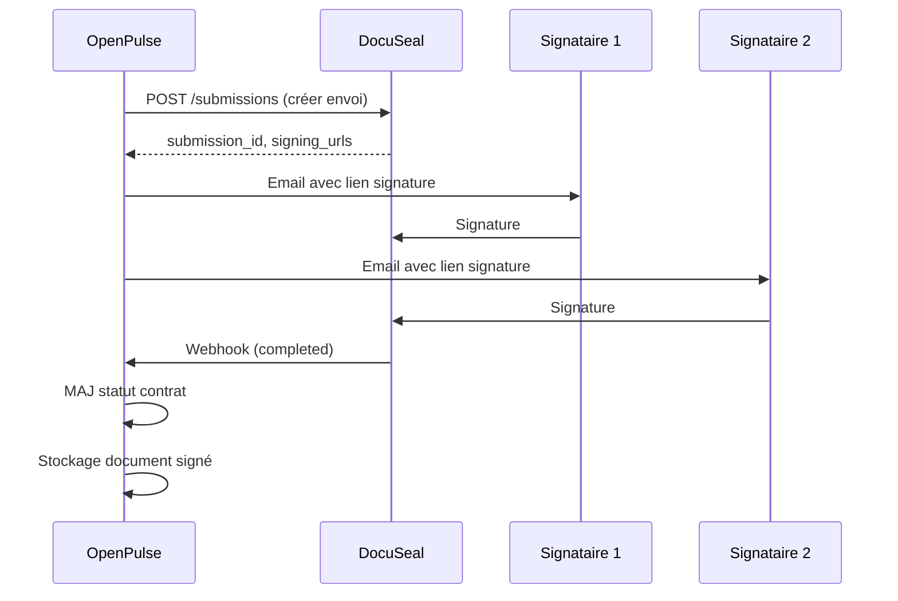

# Guide Technique - Module Contrats

> **Version**: 1.9.0 | **Dernière mise à jour**: Mars 2026

## Table des Matières

- [Vue d'ensemble](#vue-densemble)
- [Architecture](#architecture)
- [Composants](#composants)
- [Hooks](#hooks)
- [Tables de Base de Données](#tables-de-base-de-données)
- [Intégration DocuSeal](#intégration-docuseal)
- [Edge Functions](#edge-functions)

---

## Vue d'ensemble

Le module Contrats gère le cycle de vie complet des contrats :

| Fonctionnalité | Description |
|----------------|-------------|
| **Modèles** | Templates de contrats réutilisables |
| **Clauses** | Bibliothèque de clauses standardisées |
| **Génération** | Création de contrats depuis modèles |
| **Signatures** | Signatures électroniques via DocuSeal |
| **Alertes** | Notifications d'échéance et renouvellement |
| **Avenants** | Modifications contractuelles |

---

## Architecture

```
┌─────────────────────────────────────────────────────────────┐
│                      CONTRATS MODULE                         │
├─────────────────────────────────────────────────────────────┤
│  Routes: /contrats, /contrats/:id                            │
├─────────────────────────────────────────────────────────────┤
│                                                              │
│  ┌─────────────┐  ┌─────────────┐  ┌─────────────┐         │
│  │  Modèles    │→→│  Contrats   │→→│ Signatures  │         │
│  │ (Templates) │  │ (Instances) │  │ (DocuSeal)  │         │
│  └─────────────┘  └─────────────┘  └─────────────┘         │
│         │                │                │                  │
│         ▼                ▼                ▼                  │
│  ┌─────────────┐  ┌─────────────┐  ┌─────────────┐         │
│  │   Clauses   │  │  Avenants   │  │  Documents  │         │
│  └─────────────┘  └─────────────┘  └─────────────┘         │
│                          │                                   │
│                          ▼                                   │
│  ┌─────────────────────────────────────────────────────┐   │
│  │                    Alertes                            │   │
│  │  (Échéances, Renouvellements, Clauses expirées)      │   │
│  └─────────────────────────────────────────────────────┘   │
└─────────────────────────────────────────────────────────────┘
```

---

## Composants

### Composants Principaux (`src/components/contrats/`)

| Composant | Description |
|-----------|-------------|
| `ContratsList.tsx` | Liste des contrats avec filtres |
| `ContratDetail.tsx` | Vue détaillée d'un contrat |
| `ContratFormDialog.tsx` | Création/édition contrat |
| `TemplatesList.tsx` | Gestion des modèles |
| `TemplateEditor.tsx` | Éditeur de modèle avec variables |
| `ClausesLibrary.tsx` | Bibliothèque de clauses |
| `ClauseEditor.tsx` | Éditeur de clause |
| `SignaturePanel.tsx` | Interface de signature DocuSeal |
| `AvenantFormDialog.tsx` | Création d'avenant |
| `AlertesContrats.tsx` | Dashboard des alertes |

### Widgets

```tsx
// Widget alertes dans sidebar
<ContratsAlertesWidget />

// Badge contrats en attente de signature
<ContratsPendingBadge count={pendingCount} />
```

---

## Hooks

| Hook | Description |
|------|-------------|
| `useContrats` | CRUD contrats |
| `useContratTemplates` | Gestion modèles |
| `useContratClauses` | Bibliothèque clauses |
| `useContratSignatures` | Statut signatures DocuSeal |
| `useContratAlertes` | Alertes échéances |
| `useContratAvenants` | Gestion avenants |

### Exemple d'utilisation

```typescript
import { useContrats } from '@/hooks/useContrats';

function ContratsPage() {
  const { 
    data: contrats, 
    isLoading,
    createContrat,
    generateFromTemplate 
  } = useContrats({
    etablissementId: 'uuid',
    statut: 'actif'
  });

  const handleGenerate = async (templateId: string) => {
    await generateFromTemplate.mutateAsync({
      templateId,
      etablissementId: 'uuid',
      variables: {
        nom_client: 'CHU Paris',
        date_debut: '2026-01-01'
      }
    });
  };
}
```

---

## Tables de Base de Données

### `contrats`

```sql
CREATE TABLE contrats (
  id UUID PRIMARY KEY DEFAULT gen_random_uuid(),
  etablissement_id UUID REFERENCES etablissements,
  
  -- Informations générales
  titre TEXT NOT NULL,
  reference TEXT UNIQUE,
  type TEXT, -- licence, maintenance, prestation
  
  -- Dates
  date_debut DATE NOT NULL,
  date_fin DATE,
  date_signature DATE,
  duree_mois INTEGER,
  
  -- Renouvellement
  renouvellement_auto BOOLEAN DEFAULT false,
  preavis_jours INTEGER DEFAULT 90,
  
  -- Montants
  montant_annuel NUMERIC,
  conditions_paiement TEXT,
  
  -- Statut
  statut TEXT DEFAULT 'brouillon', -- brouillon, en_signature, signe, actif, expire, resilie
  
  -- DocuSeal
  docuseal_submission_id TEXT,
  docuseal_document_url TEXT,
  
  -- Modèle source
  template_id UUID REFERENCES contrat_templates,
  
  -- Document final
  document_url TEXT,
  
  created_by UUID REFERENCES profiles,
  created_at TIMESTAMPTZ DEFAULT now(),
  updated_at TIMESTAMPTZ DEFAULT now()
);
```

### `contrat_templates`

```sql
CREATE TABLE contrat_templates (
  id UUID PRIMARY KEY DEFAULT gen_random_uuid(),
  
  nom TEXT NOT NULL,
  description TEXT,
  type TEXT, -- licence, maintenance, prestation
  
  -- Contenu avec variables {{nom_client}}, {{date_debut}}...
  contenu TEXT NOT NULL,
  
  -- Variables disponibles
  variables JSONB DEFAULT '[]',
  
  -- Clauses par défaut
  clauses_ids UUID[] DEFAULT '{}',
  
  actif BOOLEAN DEFAULT true,
  version INTEGER DEFAULT 1,
  
  created_by UUID REFERENCES profiles,
  created_at TIMESTAMPTZ DEFAULT now(),
  updated_at TIMESTAMPTZ DEFAULT now()
);
```

### `contrat_clauses`

```sql
CREATE TABLE contrat_clauses (
  id UUID PRIMARY KEY DEFAULT gen_random_uuid(),
  
  titre TEXT NOT NULL,
  contenu TEXT NOT NULL,
  
  categorie TEXT, -- general, confidentialite, responsabilite, resiliation
  obligatoire BOOLEAN DEFAULT false,
  
  -- Version pour suivi des modifications
  version INTEGER DEFAULT 1,
  
  actif BOOLEAN DEFAULT true,
  
  created_at TIMESTAMPTZ DEFAULT now(),
  updated_at TIMESTAMPTZ DEFAULT now()
);
```

### `contrat_alertes`

```sql
CREATE TABLE contrat_alertes (
  id UUID PRIMARY KEY DEFAULT gen_random_uuid(),
  contrat_id UUID REFERENCES contrats NOT NULL,
  
  type TEXT NOT NULL, -- echeance, renouvellement, preavis
  date_alerte DATE NOT NULL,
  message TEXT,
  
  statut TEXT DEFAULT 'active', -- active, traitee, ignoree
  
  notified_at TIMESTAMPTZ,
  treated_at TIMESTAMPTZ,
  treated_by UUID REFERENCES profiles,
  
  created_at TIMESTAMPTZ DEFAULT now()
);
```

### `contrat_avenants`

```sql
CREATE TABLE contrat_avenants (
  id UUID PRIMARY KEY DEFAULT gen_random_uuid(),
  contrat_id UUID REFERENCES contrats NOT NULL,
  
  numero INTEGER NOT NULL,
  titre TEXT NOT NULL,
  description TEXT,
  
  -- Modifications
  modifications JSONB,
  
  date_effet DATE NOT NULL,
  
  -- Signature
  docuseal_submission_id TEXT,
  statut TEXT DEFAULT 'brouillon',
  
  created_by UUID REFERENCES profiles,
  created_at TIMESTAMPTZ DEFAULT now()
);
```

---

## Intégration DocuSeal

### Configuration

```typescript
// Secrets Supabase
DOCUSEAL_API_KEY=xxx
DOCUSEAL_API_URL=https://api.docuseal.co
```

### Workflow de Signature



### Edge Function: `docuseal-create-signature`

```typescript
POST /functions/v1/docuseal-create-signature
{
  "contratId": "uuid",
  "signataires": [
    {
      "email": "directeur@hopital.fr",
      "nom": "Dr. Martin",
      "role": "Client"
    },
    {
      "email": "commercial@exploitant.example.org",
      "nom": "Jean Dupont",
      "role": "Fournisseur"
    }
  ]
}

// Response
{
  "success": true,
  "submissionId": "docuseal-sub-123",
  "signingUrls": [
    { "email": "directeur@hopital.fr", "url": "https://..." },
    { "email": "commercial@exploitant.example.org", "url": "https://..." }
  ]
}
```

### Edge Function: `docuseal-webhook`

Réception des webhooks DocuSeal :

```typescript
// Webhook payload
{
  "event_type": "submission.completed",
  "timestamp": "2026-01-15T10:00:00Z",
  "data": {
    "id": "docuseal-sub-123",
    "status": "completed",
    "documents": [
      {
        "name": "contrat-signe.pdf",
        "url": "https://..."
      }
    ]
  }
}
```

**Vérification de signature** (HMAC) :
```typescript
const signature = req.headers.get('X-DocuSeal-Signature');
const isValid = verifyWebhookSignature(body, signature, DOCUSEAL_WEBHOOK_SECRET);

if (!isValid) {
  console.warn('Invalid DocuSeal webhook signature');
  // Traitement quand même mais avec warning (audit)
}
```

---

## Edge Functions

### `contract-ai-assist`

Assistance IA pour la rédaction de contrats.

```typescript
POST /functions/v1/contract-ai-assist
{
  "action": "suggest_clauses",
  "contratType": "licence",
  "context": "CHU 500 lits, durée 3 ans"
}

// Response
{
  "success": true,
  "suggestions": [
    {
      "clauseId": "uuid",
      "titre": "Clause de confidentialité renforcée",
      "raison": "Établissement de santé, données sensibles"
    }
  ]
}
```

---

## Alertes Automatiques

Le système génère automatiquement des alertes :

| Type | Déclencheur | Délai |
|------|-------------|-------|
| `preavis` | Date fin - préavis | Configurable |
| `echeance` | Date fin | 30, 15, 7 jours |
| `renouvellement` | Date renouvellement | 60 jours |

### Trigger SQL

```sql
CREATE OR REPLACE FUNCTION generate_contrat_alertes()
RETURNS TRIGGER AS $$
BEGIN
  -- Alerte préavis
  IF NEW.preavis_jours IS NOT NULL THEN
    INSERT INTO contrat_alertes (contrat_id, type, date_alerte, message)
    VALUES (
      NEW.id, 
      'preavis',
      NEW.date_fin - (NEW.preavis_jours || ' days')::INTERVAL,
      'Préavis de résiliation à envoyer'
    );
  END IF;
  
  -- Alertes échéance (30, 15, 7 jours)
  INSERT INTO contrat_alertes (contrat_id, type, date_alerte, message)
  SELECT 
    NEW.id,
    'echeance',
    NEW.date_fin - (days || ' days')::INTERVAL,
    'Échéance dans ' || days || ' jours'
  FROM unnest(ARRAY[30, 15, 7]) AS days;
  
  RETURN NEW;
END;
$$ LANGUAGE plpgsql;
```

---

*Documentation mise à jour en mars 2026 — v1.9.0*
