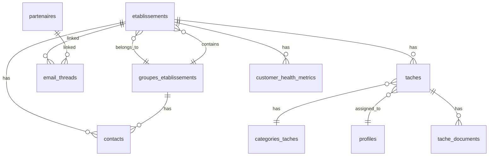
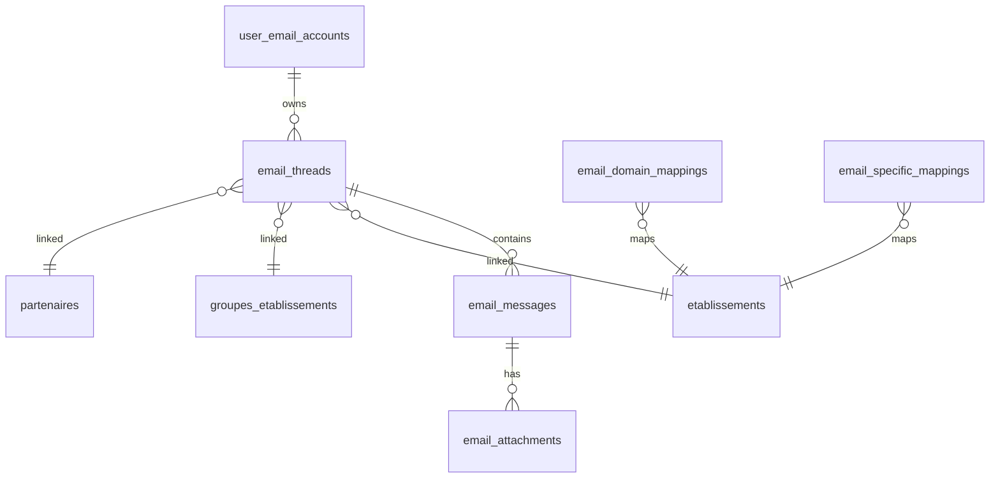
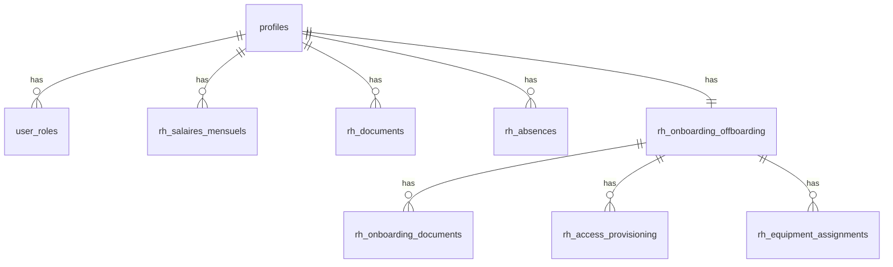
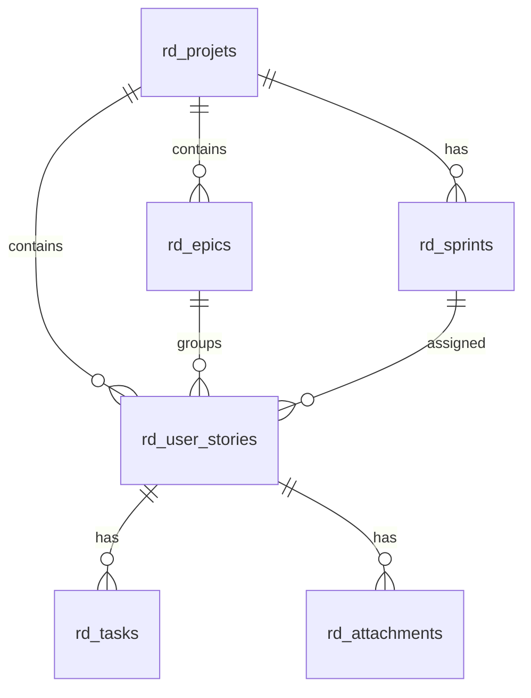

# Schéma de Base de Données - OpenPulse

> **Version**: 1.9.0 | **Dernière mise à jour**: Mars 2026

Documentation complète du schéma PostgreSQL Supabase.

## Table des Matières

- [Vue d'Ensemble](#vue-densemble)
- [Diagramme ERD](#diagramme-erd)
- [Tables par Module](#tables-par-module)
- [Politiques RLS](#politiques-rls)
- [Fonctions SQL](#fonctions-sql)
- [Triggers](#triggers)
- [Index de Performance](#index-de-performance)

---

## Vue d'Ensemble

| Statistique | Valeur |
|-------------|--------|
| Tables | 151 |
| Vues | 15+ |
| Fonctions SQL | 50+ |
| Triggers | 30+ |
| Politiques RLS | 450+ |
| Types ENUM | 10+ |

> **Note**: Comptage automatisé depuis `src/integrations/supabase/types.ts` — Mars 2026.

---

## Diagramme ERD

### Module CRM



### Module Email



### Module RH



### Module R&D



---

## Tables par Module

### Authentification & Profils

#### `profiles`

Profils utilisateurs (extension de auth.users).

```sql
CREATE TABLE profiles (
  id UUID PRIMARY KEY REFERENCES auth.users,
  email TEXT,
  full_name TEXT,
  avatar_url TEXT,
  telephone TEXT,
  poste TEXT,
  departement TEXT,
  date_entree DATE,
  date_sortie DATE,
  actif BOOLEAN DEFAULT true,
  two_factor_enabled BOOLEAN DEFAULT false,
  created_at TIMESTAMPTZ DEFAULT now(),
  updated_at TIMESTAMPTZ DEFAULT now()
);
```

#### `user_roles`

Rôles des utilisateurs.

```sql
CREATE TABLE user_roles (
  id UUID PRIMARY KEY DEFAULT gen_random_uuid(),
  user_id UUID REFERENCES auth.users NOT NULL,
  role app_role NOT NULL,
  created_at TIMESTAMPTZ DEFAULT now(),
  UNIQUE(user_id, role)
);

-- Enum des rôles
CREATE TYPE app_role AS ENUM (
  'admin',
  'direction',
  'chef_projet',
  'csm',
  'commercial',
  'rh',
  'user'
);
```

---

### CRM / Établissements

#### `etablissements`

Établissements de santé.

```sql
CREATE TABLE etablissements (
  id UUID PRIMARY KEY DEFAULT gen_random_uuid(),
  nom TEXT NOT NULL,
  statut TEXT DEFAULT 'Prospect',
  
  -- Localisation
  adresse TEXT,
  code_postal TEXT,
  ville TEXT,
  region TEXT,
  latitude NUMERIC,
  longitude NUMERIC,
  
  -- Contact
  telephone TEXT,
  email TEXT,
  site_web TEXT,
  
  -- Commercial
  valeur_pipeline NUMERIC,
  date_previsionnelle_signature DATE,
  modele_statique_succes TEXT,
  tarifs_palliers JSONB,
  
  -- Équipe assignée
  commercial_id UUID REFERENCES profiles,
  csm_id UUID REFERENCES profiles,
  chef_projet_id UUID REFERENCES profiles,
  
  -- Groupe
  groupe_id UUID REFERENCES groupes_etablissements,
  
  -- Métadonnées
  logo_url TEXT,
  notes TEXT,
  created_at TIMESTAMPTZ DEFAULT now(),
  updated_at TIMESTAMPTZ DEFAULT now()
);
```

#### `contacts`

Contacts des établissements.

```sql
CREATE TABLE contacts (
  id UUID PRIMARY KEY DEFAULT gen_random_uuid(),
  etablissement_id UUID REFERENCES etablissements,
  groupe_id UUID REFERENCES groupes_etablissements,
  
  nom TEXT NOT NULL,
  prenom TEXT,
  fonction TEXT NOT NULL,
  email TEXT,
  telephone TEXT,
  
  type_contact TEXT,
  niveau_contact TEXT,
  est_contact_principal BOOLEAN DEFAULT false,
  
  created_source TEXT,
  created_metadata JSONB,
  
  created_at TIMESTAMPTZ DEFAULT now(),
  updated_at TIMESTAMPTZ DEFAULT now()
);
```

#### `taches`

Tâches et projets.

```sql
CREATE TABLE taches (
  id UUID PRIMARY KEY DEFAULT gen_random_uuid(),
  etablissement_id UUID REFERENCES etablissements,
  
  titre TEXT NOT NULL,
  description TEXT,
  
  categorie_id UUID REFERENCES categories_taches,
  priorite priorite_tache DEFAULT 'normale',
  statut TEXT DEFAULT 'a_faire',
  
  date_echeance DATE,
  date_debut DATE,
  
  responsable_id UUID REFERENCES profiles,
  created_by UUID REFERENCES profiles,
  
  -- Récurrence
  recurrence_type TEXT,
  recurrence_interval INTEGER,
  parent_task_id UUID REFERENCES taches,
  
  ordre INTEGER DEFAULT 0,
  created_at TIMESTAMPTZ DEFAULT now(),
  updated_at TIMESTAMPTZ DEFAULT now()
);

CREATE TYPE priorite_tache AS ENUM ('basse', 'normale', 'haute', 'urgente');
```

---

### Trésorerie

#### `tresorerie_revenus`

Revenus.

```sql
CREATE TABLE tresorerie_revenus (
  id UUID PRIMARY KEY DEFAULT gen_random_uuid(),
  etablissement_id UUID REFERENCES etablissements,
  
  description TEXT NOT NULL,
  montant NUMERIC NOT NULL,
  date_revenu DATE NOT NULL,
  
  type_revenu TEXT,
  source TEXT,
  statut TEXT DEFAULT 'en_attente',
  
  facture_id UUID REFERENCES tresorerie_factures,
  
  created_at TIMESTAMPTZ DEFAULT now(),
  updated_at TIMESTAMPTZ DEFAULT now()
);
```

#### `tresorerie_depenses`

Dépenses.

```sql
CREATE TABLE tresorerie_depenses (
  id UUID PRIMARY KEY DEFAULT gen_random_uuid(),
  
  description TEXT NOT NULL,
  montant NUMERIC NOT NULL,
  date_depense DATE NOT NULL,
  
  categorie TEXT,
  source_code TEXT,
  
  profile_id UUID REFERENCES profiles,
  fournisseur TEXT,
  
  created_at TIMESTAMPTZ DEFAULT now(),
  updated_at TIMESTAMPTZ DEFAULT now()
);
```

---

### Formations

#### `formation_sessions`

Sessions de formation.

```sql
CREATE TABLE formation_sessions (
  id UUID PRIMARY KEY DEFAULT gen_random_uuid(),
  etablissement_id UUID REFERENCES etablissements NOT NULL,
  
  titre TEXT NOT NULL,
  description TEXT,
  type_formation TEXT,
  
  date_session DATE NOT NULL,
  heure_debut TIME,
  heure_fin TIME,
  lieu TEXT,
  
  formateur_id UUID REFERENCES profiles,
  nombre_participants_prevus INTEGER,
  nombre_participants_reels INTEGER DEFAULT 0,
  
  statut TEXT DEFAULT 'planifiee',
  
  created_at TIMESTAMPTZ DEFAULT now(),
  updated_at TIMESTAMPTZ DEFAULT now()
);
```

#### `formation_emargements`

Émargements.

```sql
CREATE TABLE formation_emargements (
  id UUID PRIMARY KEY DEFAULT gen_random_uuid(),
  session_id UUID REFERENCES formation_sessions NOT NULL,
  user_id UUID REFERENCES etablissement_users NOT NULL,
  
  signature_image TEXT,
  present BOOLEAN DEFAULT true,
  
  heure_arrivee TIME,
  commentaire TEXT,
  
  created_at TIMESTAMPTZ DEFAULT now(),
  UNIQUE(session_id, user_id)
);
```

---

## Politiques RLS

### Pattern Standard

```sql
-- Lecture: utilisateurs authentifiés
CREATE POLICY "Authenticated users can read"
ON table_name
FOR SELECT
TO authenticated
USING (true);

-- Écriture: propriétaire ou admin
CREATE POLICY "Owners and admins can modify"
ON table_name
FOR ALL
TO authenticated
USING (
  user_id = auth.uid() 
  OR public.is_admin()
);
```

### Fonctions de Sécurité

```sql
-- Vérification admin
CREATE OR REPLACE FUNCTION public.is_admin()
RETURNS BOOLEAN
LANGUAGE sql
STABLE
SECURITY DEFINER
SET search_path = public, pg_temp
AS $$
  SELECT EXISTS (
    SELECT 1 FROM public.user_roles
    WHERE user_id = auth.uid()
    AND role = 'admin'
  );
$$;

-- Vérification rôle spécifique
CREATE OR REPLACE FUNCTION public.has_role(check_user_id UUID, check_role app_role)
RETURNS BOOLEAN
LANGUAGE sql
STABLE
SECURITY DEFINER
SET search_path = public, pg_temp
AS $$
  SELECT EXISTS (
    SELECT 1 FROM public.user_roles
    WHERE user_id = check_user_id
    AND role = check_role
  );
$$;

-- Gestion RH (admin OU rh)
CREATE OR REPLACE FUNCTION public.can_manage_rh_data()
RETURNS BOOLEAN
LANGUAGE sql
STABLE
SECURITY DEFINER
SET search_path = public, pg_temp
AS $$
  SELECT EXISTS (
    SELECT 1 FROM public.user_roles
    WHERE user_id = auth.uid()
    AND role IN ('admin', 'rh')
  );
$$;
```

---

## Fonctions SQL

### Mise à Jour Automatique updated_at

```sql
CREATE OR REPLACE FUNCTION public.update_updated_at_column()
RETURNS TRIGGER AS $$
BEGIN
  NEW.updated_at = now();
  RETURN NEW;
END;
$$ LANGUAGE plpgsql;
```

### Génération de Tâches par Phase

```sql
CREATE OR REPLACE FUNCTION public.on_status_change_generate_tasks()
RETURNS TRIGGER AS $$
BEGIN
  -- Génère les tâches appropriées selon le nouveau statut
  IF NEW.statut != OLD.statut THEN
    -- Commercial phase
    IF NEW.statut IN ('Prospect', 'Attente RDV', 'RDV pris') THEN
      -- Créer tâches commerciales
    END IF;
    
    -- Déploiement phase
    IF NEW.statut IN ('Contractuel post-sig', 'Déploiement') THEN
      -- Créer tâches déploiement
    END IF;
    
    -- Production phase
    IF NEW.statut = 'Production' THEN
      -- Créer tâches support/suivi
    END IF;
  END IF;
  
  RETURN NEW;
END;
$$ LANGUAGE plpgsql SECURITY DEFINER;
```

---

## Triggers

### Triggers Communs

```sql
-- updated_at automatique
CREATE TRIGGER set_updated_at
BEFORE UPDATE ON table_name
FOR EACH ROW
EXECUTE FUNCTION update_updated_at_column();

-- Génération tâches
CREATE TRIGGER on_etablissement_status_change
AFTER UPDATE OF statut ON etablissements
FOR EACH ROW
EXECUTE FUNCTION on_status_change_generate_tasks();

-- Compteurs threads
CREATE TRIGGER update_thread_counters
AFTER INSERT OR DELETE ON email_messages
FOR EACH ROW
EXECUTE FUNCTION update_thread_message_count();
```

---

## Index de Performance

### Index Principaux

```sql
-- Établissements
CREATE INDEX idx_etablissements_statut ON etablissements(statut);
CREATE INDEX idx_etablissements_groupe ON etablissements(groupe_id);
CREATE INDEX idx_etablissements_commercial ON etablissements(commercial_id);
CREATE INDEX idx_etablissements_csm ON etablissements(csm_id);

-- Tâches
CREATE INDEX idx_taches_etablissement ON taches(etablissement_id);
CREATE INDEX idx_taches_responsable ON taches(responsable_id);
CREATE INDEX idx_taches_statut ON taches(statut);
CREATE INDEX idx_taches_echeance ON taches(date_echeance);

-- Emails
CREATE INDEX idx_email_threads_account ON email_threads(user_email_account_id);
CREATE INDEX idx_email_threads_etablissement ON email_threads(etablissement_id);
CREATE INDEX idx_email_threads_last_message ON email_threads(last_message_date DESC);
CREATE INDEX idx_email_messages_thread ON email_messages(thread_id);
CREATE INDEX idx_email_messages_sent ON email_messages(sent_date DESC);

-- RH
CREATE INDEX idx_rh_salaires_profile ON rh_salaires_mensuels(profile_id);
CREATE INDEX idx_rh_salaires_periode ON rh_salaires_mensuels(periode);

-- R&D
CREATE INDEX idx_rd_stories_sprint ON rd_user_stories(sprint_id);
CREATE INDEX idx_rd_stories_status ON rd_user_stories(statut);
CREATE INDEX idx_rd_tasks_story ON rd_tasks(story_id);
```

### Index Full-Text

```sql
-- Recherche établissements
CREATE INDEX idx_etablissements_search 
ON etablissements 
USING GIN(to_tsvector('french', nom || ' ' || COALESCE(ville, '')));

-- Recherche emails
CREATE INDEX idx_email_threads_search
ON email_threads
USING GIN(to_tsvector('french', subject || ' ' || COALESCE(ai_summary, '')));
```

---

## Vues

### `email_threads_list_view`

Vue optimisée pour la liste des threads.

```sql
CREATE VIEW email_threads_list_view AS
SELECT 
  t.*,
  e.nom AS etablissement_nom,
  e.logo_url AS etablissement_logo,
  g.nom AS groupe_nom,
  p.nom AS partenaire_nom,
  a.email_address AS account_email
FROM email_threads t
LEFT JOIN etablissements e ON t.etablissement_id = e.id
LEFT JOIN groupes_etablissements g ON t.groupe_id = g.id
LEFT JOIN partenaires p ON t.partenaire_id = p.id
JOIN user_email_accounts a ON t.user_email_account_id = a.id;
```

### `etablissements_public`

Vue publique des établissements.

```sql
CREATE VIEW etablissements_public AS
SELECT 
  id, nom, ville, region, statut, logo_url
FROM etablissements
WHERE statut IN ('Production', 'Contractuel');
```

---

*Schéma mis à jour en mars 2026 — v1.9.0*
