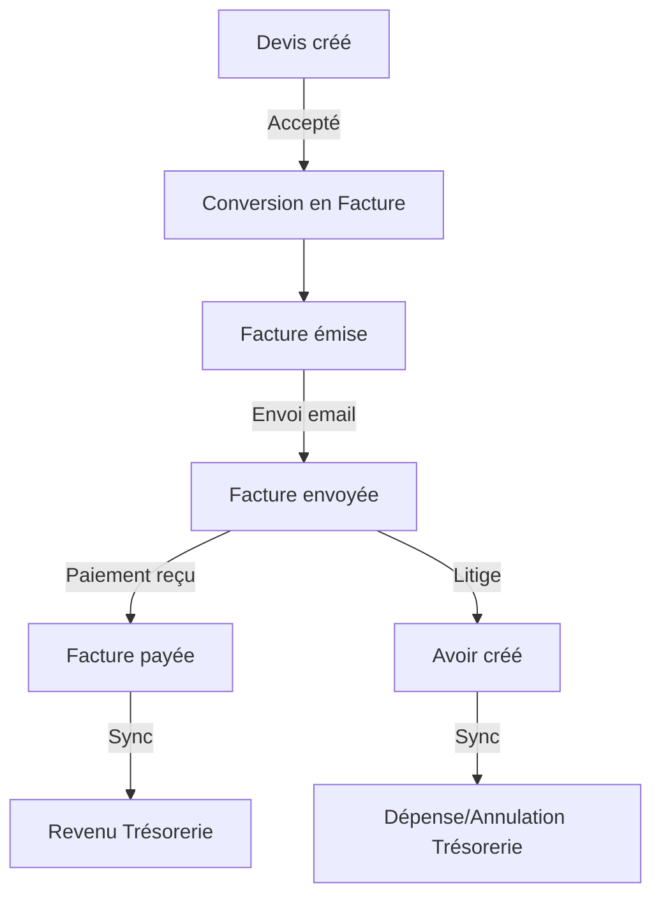

# Guide Technique - Module Facturation

> **Version**: 1.9.0 | **Dernière mise à jour**: Mars 2026

## Table des Matières

- [Vue d'ensemble](#vue-densemble)
- [Architecture](#architecture)
- [Composants](#composants)
- [Hooks](#hooks)
- [Tables de Base de Données](#tables-de-base-de-données)
- [Edge Functions](#edge-functions)
- [Intégration Qonto](#intégration-qonto)
- [Export FEC](#export-fec)

---

## Vue d'ensemble

Le module Facturation gère l'ensemble du cycle de facturation :

| Fonctionnalité | Description |
|----------------|-------------|
| **Devis** | Création, envoi, conversion en facture |
| **Factures** | Génération, numérotation automatique, envoi |
| **Avoirs** | Notes de crédit liées aux factures |
| **Catalogue** | Produits et services avec prix |
| **Export FEC** | Fichier des Écritures Comptables |
| **Réconciliation** | Liaison automatique avec transactions Qonto |

---

## Architecture

```
┌─────────────────────────────────────────────────────────────┐
│                     FACTURATION MODULE                       │
├─────────────────────────────────────────────────────────────┤
│  Routes: /facturation, /etablissements/:id (onglet Facturation) │
├─────────────────────────────────────────────────────────────┤
│                                                              │
│  ┌─────────────┐  ┌─────────────┐  ┌─────────────┐         │
│  │   Devis     │  │  Factures   │  │   Avoirs    │         │
│  │  (Quotes)   │→→│ (Invoices)  │→→│  (Credits)  │         │
│  └─────────────┘  └─────────────┘  └─────────────┘         │
│         │                │                │                  │
│         ▼                ▼                ▼                  │
│  ┌─────────────────────────────────────────────────────┐   │
│  │              tresorerie_factures                      │   │
│  │              tresorerie_facture_lignes               │   │
│  │              tresorerie_revenus (sync)               │   │
│  └─────────────────────────────────────────────────────┘   │
│                          │                                   │
│                          ▼                                   │
│  ┌─────────────────────────────────────────────────────┐   │
│  │              Qonto API (réconciliation)               │   │
│  └─────────────────────────────────────────────────────┘   │
└─────────────────────────────────────────────────────────────┘
```

---

## Composants

### Composants Principaux (`src/components/facturation/`)

| Composant | Description |
|-----------|-------------|
| `FacturationDashboard.tsx` | Dashboard avec KPIs (CA, impayés, encaissés) |
| `FactureFormDialog.tsx` | Formulaire création/édition facture |
| `DevisFormDialog.tsx` | Formulaire création devis |
| `AvoirFormDialog.tsx` | Formulaire création avoir |
| `FacturesList.tsx` | Liste des factures avec filtres |
| `DevisList.tsx` | Liste des devis |
| `CatalogueProduits.tsx` | Gestion catalogue produits/services |
| `LigneFacture.tsx` | Ligne de facture (éditable) |
| `FacturePDFPreview.tsx` | Prévisualisation PDF |

### Composants Établissement

Dans l'onglet "Facturation" de chaque établissement :

```tsx
// src/components/etablissement/tabs/FacturationTab.tsx
<FacturationTab 
  etablissementId={id}
  onFactureCreated={refetch}
/>
```

---

## Hooks

| Hook | Description |
|------|-------------|
| `useFactures` | CRUD factures avec filtres |
| `useDevis` | CRUD devis |
| `useAvoirs` | CRUD avoirs |
| `useCatalogueProduits` | Gestion catalogue |
| `useFacturationKPIs` | Calcul KPIs facturation |
| `useReconciliationQonto` | Réconciliation transactions |

### Exemple d'utilisation

```typescript
import { useFactures } from '@/hooks/useFactures';

function FacturesPage() {
  const { 
    data: factures, 
    isLoading,
    createFacture,
    updateFacture,
    deleteFacture 
  } = useFactures({
    etablissementId: 'uuid',
    statut: 'emise',
    periode: '2026-01'
  });

  const handleCreate = async (data: FactureData) => {
    await createFacture.mutateAsync(data);
  };
}
```

---

## Tables de Base de Données

### `tresorerie_factures`

```sql
CREATE TABLE tresorerie_factures (
  id UUID PRIMARY KEY DEFAULT gen_random_uuid(),
  etablissement_id UUID REFERENCES etablissements,
  
  -- Numérotation
  numero TEXT NOT NULL UNIQUE,
  type TEXT DEFAULT 'facture', -- facture, devis, avoir
  
  -- Montants
  montant_ht NUMERIC NOT NULL,
  montant_tva NUMERIC DEFAULT 0,
  montant_ttc NUMERIC NOT NULL,
  
  -- Dates
  date_emission DATE NOT NULL,
  date_echeance DATE,
  date_paiement DATE,
  
  -- Statut
  statut TEXT DEFAULT 'brouillon', -- brouillon, emise, envoyee, payee, annulee
  
  -- Client
  client_nom TEXT NOT NULL,
  client_adresse TEXT,
  client_siret TEXT,
  client_email TEXT,
  
  -- Liaison devis/avoir
  devis_origine_id UUID REFERENCES tresorerie_factures,
  facture_origine_id UUID REFERENCES tresorerie_factures,
  
  -- Qonto
  qonto_transaction_id TEXT,
  
  -- Métadonnées
  notes TEXT,
  pdf_url TEXT,
  created_at TIMESTAMPTZ DEFAULT now(),
  updated_at TIMESTAMPTZ DEFAULT now()
);
```

### `tresorerie_facture_lignes`

```sql
CREATE TABLE tresorerie_facture_lignes (
  id UUID PRIMARY KEY DEFAULT gen_random_uuid(),
  facture_id UUID REFERENCES tresorerie_factures NOT NULL,
  
  designation TEXT NOT NULL,
  description TEXT,
  quantite NUMERIC DEFAULT 1,
  prix_unitaire_ht NUMERIC NOT NULL,
  taux_tva NUMERIC DEFAULT 20,
  
  montant_ht NUMERIC GENERATED ALWAYS AS (quantite * prix_unitaire_ht) STORED,
  
  produit_id UUID REFERENCES catalogue_produits,
  ordre INTEGER DEFAULT 0,
  
  created_at TIMESTAMPTZ DEFAULT now()
);
```

### `catalogue_produits`

```sql
CREATE TABLE catalogue_produits (
  id UUID PRIMARY KEY DEFAULT gen_random_uuid(),
  
  code TEXT UNIQUE,
  nom TEXT NOT NULL,
  description TEXT,
  
  prix_unitaire_ht NUMERIC NOT NULL,
  taux_tva NUMERIC DEFAULT 20,
  unite TEXT DEFAULT 'unité', -- unité, heure, jour, mois
  
  categorie TEXT,
  actif BOOLEAN DEFAULT true,
  
  created_at TIMESTAMPTZ DEFAULT now(),
  updated_at TIMESTAMPTZ DEFAULT now()
);
```

---

## Edge Functions

### `generate-invoice-pdf`

Génère un PDF de facture.

```typescript
POST /functions/v1/generate-invoice-pdf
{
  "factureId": "uuid"
}

// Response
{
  "success": true,
  "pdfUrl": "https://storage.../facture-2026-001.pdf"
}
```

### `generate-quote-pdf`

Génère un PDF de devis.

```typescript
POST /functions/v1/generate-quote-pdf
{
  "devisId": "uuid"
}
```

### `export-fec`

Exporte le Fichier des Écritures Comptables.

```typescript
POST /functions/v1/export-fec
{
  "exercice": "2025",
  "format": "txt"  // txt, csv
}

// Response
{
  "success": true,
  "downloadUrl": "https://...",
  "filename": "FEC_2025.txt"
}
```

### `sync-factures-tresorerie`

Synchronise les factures avec le module trésorerie.

```typescript
POST /functions/v1/sync-factures-tresorerie
{
  "factureId": "uuid",
  "action": "paid"  // created, paid, cancelled
}
```

---

## Intégration Qonto

### Réconciliation Automatique

Lorsqu'une transaction Qonto est synchronisée :

1. Le système recherche une facture correspondante (montant, référence)
2. Si trouvée, liaison via `qonto_transaction_id`
3. Mise à jour du statut facture → "payée"
4. Création automatique du revenu dans trésorerie

```typescript
// src/hooks/useQontoReconciliation.ts
const { reconcile, pendingMatches } = useQontoReconciliation();

// Réconciliation manuelle
await reconcile({
  transactionId: 'qonto-tx-id',
  factureId: 'facture-uuid'
});
```

---

## Export FEC

Le Fichier des Écritures Comptables respecte le format légal français :

| Champ | Description |
|-------|-------------|
| JournalCode | Code journal (VE = Ventes) |
| JournalLib | Libellé journal |
| EcritureNum | Numéro d'écriture |
| EcritureDate | Date d'écriture |
| CompteNum | Numéro de compte |
| CompteLib | Libellé compte |
| CompAuxNum | Compte auxiliaire |
| CompAuxLib | Libellé auxiliaire |
| PieceRef | Référence pièce |
| PieceDate | Date pièce |
| EcritureLib | Libellé écriture |
| Debit | Montant débit |
| Credit | Montant crédit |
| EcritureLet | Lettrage |
| DateLet | Date lettrage |
| ValidDate | Date validation |
| Montantdevise | Montant devise |
| Idevise | Code devise |

---

## Workflow Facturation



---

*Documentation mise à jour en mars 2026 — v1.9.0*
