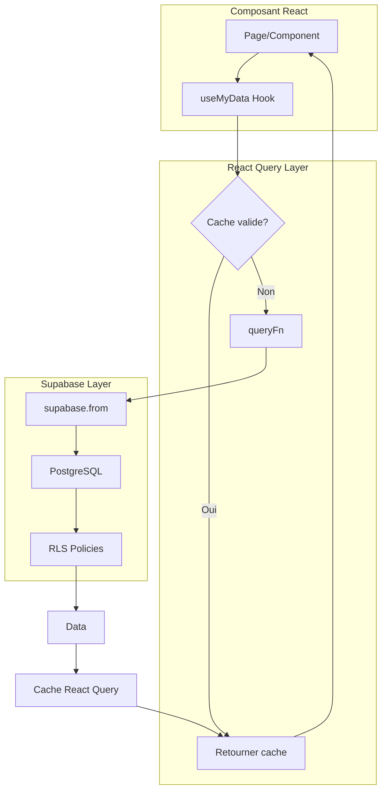

# Architecture des Hooks - OpenPulse

## Vue d'Ensemble

Ce document décrit l'architecture et les patterns utilisés pour les hooks React Query dans l'application.

---

## Diagramme de Flux



---

## Patterns Standards

### 1. Hook de Query Simple

```typescript
import { useQuery } from "@tanstack/react-query";
import { supabase } from "@/integrations/supabase/client";
import { queryPresets } from "@/lib/queryPresets";

export function useEtablissements() {
  return useQuery({
    queryKey: ["etablissements"],
    queryFn: async () => {
      const { data, error } = await supabase
        .from("etablissements")
        .select("id, nom, statut, ville, region, commercial_id, csm_id, groupe_id, created_at")
        .order("nom")
        .limit(5000);
      
      if (error) throw error;
      return data;
    },
    ...queryPresets.standard,
  });
}
```

### 2. Hook avec Mutations

```typescript
import { useQuery, useMutation, useQueryClient } from "@tanstack/react-query";
import { useToast } from "@/hooks/use-toast";

export function useTaches() {
  const queryClient = useQueryClient();
  const { toast } = useToast();

  const query = useQuery({
    queryKey: ["taches"],
    queryFn: async () => { /* ... */ },
    ...queryPresets.standard,
  });

  const createMutation = useMutation({
    mutationFn: async (data: CreateTacheData) => {
      const { error } = await supabase
        .from("taches")
        .insert(data);
      if (error) throw error;
    },
    onSuccess: () => {
      queryClient.invalidateQueries({ queryKey: ["taches"] });
      toast({ title: "Tâche créée" });
    },
    onError: (error: Error) => {
      toast({ 
        title: "Erreur", 
        description: error.message, 
        variant: "destructive" 
      });
    },
  });

  return {
    taches: query.data ?? [],
    isLoading: query.isLoading,
    createTache: createMutation.mutate,
    isCreating: createMutation.isPending,
  };
}
```

### 3. Hook avec Pagination

```typescript
export function useDataPaginated(params: PaginationParams) {
  const { page = 1, pageSize = 25, filters = {} } = params;

  return useQuery({
    queryKey: ["data", page, pageSize, filters],
    queryFn: async () => {
      const from = (page - 1) * pageSize;
      const to = from + pageSize - 1;

      let query = supabase
        .from("table")
        .select("id, nom, statut, created_at", { count: "exact" })
        .range(from, to);

      // Appliquer les filtres
      if (filters.search) {
        query = query.ilike("nom", `%${filters.search}%`);
      }

      const { data, count, error } = await query;
      if (error) throw error;

      return {
        items: data ?? [],
        totalCount: count ?? 0,
        totalPages: Math.ceil((count ?? 0) / pageSize),
      };
    },
    ...queryPresets.standard,
  });
}
```

---

## Query Presets

Utiliser les presets de `src/lib/queryPresets.ts` :

| Preset | staleTime | Usage |
|--------|-----------|-------|
| `realtime` | 0 | Notifications, présence |
| `frequent` | 30s | Messages, badges |
| `standard` | 2min | Établissements, contacts, tâches |
| `reference` | 30min | Templates, catégories |
| `static` | 1h | Paramètres système, tutoriels |

```typescript
import { queryPresets } from "@/lib/queryPresets";

useQuery({
  queryKey: ["my-data"],
  queryFn: /* ... */,
  ...queryPresets.standard, // staleTime: 2min
});
```

---

## Clés de Query (Query Keys)

### Convention de Nommage

```typescript
// Simple
["etablissements"]
["taches"]

// Avec ID
["etablissement", etablissementId]
["tache", tacheId]

// Avec filtres
["etablissements", "list", { statut: "actif", region: "IDF" }]

// Paginé
["taches", "paginated", { page: 1, pageSize: 25 }]

// Relation
["etablissement", etablissementId, "contacts"]
["etablissement", etablissementId, "taches"]
```

### Invalidation

```typescript
// Invalider une liste
queryClient.invalidateQueries({ queryKey: ["etablissements"] });

// Invalider un item et ses relations
queryClient.invalidateQueries({ queryKey: ["etablissement", id] });

// Invalider tout ce qui concerne les établissements
queryClient.invalidateQueries({ 
  predicate: (query) => query.queryKey[0] === "etablissements" 
});
```

---

## Gestion des Erreurs

### Pattern Recommandé

```typescript
const query = useQuery({
  queryKey: ["data"],
  queryFn: async () => {
    const { data, error } = await supabase.from("table").select("id, nom, statut, created_at").limit(500);
    
    if (error) {
      // Logger pour debug
      debug.error("[useData] Fetch error:", error);
      throw error;
    }
    
    return data;
  },
  meta: {
    errorMessage: "Impossible de charger les données",
  },
});
```

### Toast Automatique sur Erreur de Mutation

```typescript
const mutation = useMutation({
  mutationFn: async (data) => { /* ... */ },
  onError: (error: Error) => {
    toast({
      title: "Erreur",
      description: error.message,
      variant: "destructive",
    });
  },
});
```

---

## Relations et Jointures

### Select avec Relations (colonnes explicites)

```typescript
const { data } = await supabase
  .from("taches")
  .select(`
    id, titre, statut, priorite, date_echeance, ordre, created_at,
    etablissements:etablissement_id (id, nom),
    responsable:responsable_id (id, prenom, nom),
    categories_taches:categorie_id (id, nom, couleur)
  `)
  .order("echeance")
  .limit(500);
```

### Types pour Relations

```typescript
// Dans src/types/database-relations.ts
export interface TacheWithRelations {
  id: string;
  titre: string;
  etablissements?: { id: string; nom: string } | null;
  responsable?: { id: string; prenom: string; nom: string } | null;
  categories_taches?: { id: string; nom: string; couleur: string } | null;
}
```

---

## Hooks par Module

### CRM

| Hook | Table | Usage |
|------|-------|-------|
| `useEtablissements` | etablissements | Liste établissements |
| `useEtablissement` | etablissements | Détail établissement |
| `useContacts` | contacts | Contacts établissement |
| `useTaches` | taches | Tâches établissement |
| `useDashboardCoreData` | etablissements, taches | Données dashboard (SELECT optimisé) |
| `useCreateEntityMutations` | etablissements, partenaires, groupes | Création d'entités CRM (étab/partenaire/groupe) |
| `useQuoteValidationMutation` | etablissements | Validation contractuelle devis (succès/statique) |

### CSM (Customer Success Management)

| Hook | Table | Usage |
|------|-------|-------|
| `useCsmContactsMutations` | contacts | Insert, update, delete contacts CSM |
| `useCsmComptesMutations` | etablissements | Insert, update, delete comptes CSM |

### Trésorerie

| Hook | Table | Usage |
|------|-------|-------|
| `useTresorerieRevenus` | tresorerie_revenus | Revenus mensuels |
| `useTresorerieDepenses` | tresorerie_depenses | Dépenses |
| `useTresoreriePrevisionnel` | Multiple (useQueries) | Prévisions 12 mois |
| `useQontoTransactions` | tresorerie_qonto_* | Synchro bancaire |

### RH

| Hook | Table | Usage |
|------|-------|-------|
| `useProfiles` | profiles | Équipe |
| `useRHSalaires` | rh_salaires_mensuels | Paie |
| `useRHAbsences` | rh_absences | Congés |
| `useCandidates` | candidates | Recrutement |
| `useRHEntretienMutation` | rh_entretiens | Création d'entretiens (annuel, professionnel, recadrage) |

### Email

| Hook | Table | Usage |
|------|-------|-------|
| `useEmailThreads` | email_threads | Fils de discussion (avec cache domaines) |
| `useEmailMessages` | email_messages | Messages |
| `useEmailAccounts` | user_email_accounts | Comptes email |
| `useEmailUnreadCount` | email_threads | Badge non-lus (staleTime 60s) |
| `useEmailUnprocessedCount` | email_threads | Badge non-traités (staleTime 60s) |

### Projets / R&D

| Hook | Table | Usage |
|------|-------|-------|
| `useKanbanTaskMutation` | taches | Déplacement de tâches Kanban multi-projets |

### Jarvis

| Hook | Table | Usage |
|------|-------|-------|
| `useJarvisFavoritesMutations` | jarvis_favorite_commands | CRUD commandes favorites (add/remove/reorder/increment) |

### Documents (src/hooks/documents/)

Hooks spécialisés pour la gestion documentaire et l'intégration Nextcloud.

| Hook | Usage |
|------|-------|
| `useDocumentUpload` | Upload de documents avec progress |
| `useDocumentDelete` | Suppression de documents |
| `useDocumentDownload` | Téléchargement de documents |
| `useDocumentList` | Liste des documents par entité |
| `useDocumentPreview` | Prévisualisation de documents |
| `useDocumentSearch` | Recherche dans les documents |
| `useDocumentVersions` | Historique des versions |
| `useNextcloudConfig` | Configuration Nextcloud |
| `useNextcloudStorage` | Stockage Nextcloud |
| `useNextcloudSync` | Synchronisation Nextcloud |
| `useDocumentMetadata` | Métadonnées des documents |

---

## Anti-Patterns à Éviter

### ❌ Ne Pas Faire

```typescript
// 1. Pas de useState pour le loading
const [isLoading, setIsLoading] = useState(true);
// React Query gère ça automatiquement

// 2. Pas de staleTime en dur
useQuery({
  staleTime: 5 * 60 * 1000, // Utiliser queryPresets
});

// 3. Pas de any (STRICT TYPING STANDARD)
const { data } = await supabase
  .from("table")
  .select("*") as any; // ❌ Non !

// 4. Pas de throw sans contexte
if (error) throw error; // Ajouter un log DEV

// 5. Pas de SELECT * sur tables volumineuses (AUDIT MARS 2026)
.select("*") // ❌ Sélectionner les colonnes nécessaires
// Exceptions autorisées : .single(), .maybeSingle(), fromExtended(), mutations .insert()/.update().select()

// 6. Pas de logs en production
console.log("Debug"); // ❌ Utiliser debug.log() / debug.error()

// 7. Pas de query sans .limit() sur tables volumineuses (AUDIT MARS 2026)
.from("taches").select("id, titre").order("created_at") // ❌ Ajouter .limit(500-5000)

// 8. Pas de count avec select('*') (AUDIT MARS 2026)
.select("*", { count: "exact", head: true }) // ❌ Utiliser select("id", { count: "exact", head: true })
```

### ✅ Faire

```typescript
// 1. Utiliser les états React Query
const { data, isLoading, error } = useQuery(/* ... */);

// 2. Utiliser les presets
useQuery({
  ...queryPresets.standard,
});

// 3. Types stricts + colonnes explicites (AUDIT MARS 2026)
const { data } = await supabase
  .from("table")
  .select("id, nom, statut, created_at")
  .limit(500);

// 4. Logger les erreurs
if (error) {
  debug.error("[useMyHook] Error:", error);
  throw error;
}

// 5. Count queries optimisées (AUDIT MARS 2026)
const { count } = await supabase
  .from("table")
  .select("id", { count: "exact", head: true })
  .eq("statut", "actif");
```

---

## Debugging

### Logs en Développement

```typescript
import { debug } from "@/lib/debug";

// Visible uniquement en dev
debug.log("[useMyHook] Fetching data...");
debug.error("[useMyHook] Error:", error);
```

### React Query DevTools

Les DevTools sont automatiquement activés en développement. Cliquer sur l'icône en bas à droite pour inspecter le cache.

---

## Migration depuis les Anciens Patterns

Si vous rencontrez un hook avec ces patterns obsolètes :

```typescript
// Ancien pattern
const [data, setData] = useState([]);
const [isLoading, setIsLoading] = useState(true);

useEffect(() => {
  fetchData();
}, []);

const fetchData = async () => {
  setIsLoading(true);
  const { data } = await supabase.from("table").select("*");
  setData(data);
  setIsLoading(false);
};
```

Migrer vers :

```typescript
// Nouveau pattern (AUDIT MARS 2026)
const { data = [], isLoading } = useQuery({
  queryKey: ["table"],
  queryFn: async () => {
    const { data, error } = await supabase
      .from("table")
      .select("id, nom, statut, created_at")
      .limit(500);
    if (error) throw error;
    return data;
  },
  ...queryPresets.standard,
});
```

---

## Audit Performance Mars 2026 (v1.9.0)

### Règles obligatoires

L'audit de Mars 2026 (7 phases, ~90 fichiers) a établi les règles suivantes :

| Règle | Description |
|-------|-------------|
| **Colonnes explicites** | `select('id, nom, statut')` au lieu de `select('*')` sur toutes les tables volumineuses |
| **`.limit()` obligatoire** | Toute query sans pagination doit avoir un `.limit(500)` à `.limit(5000)` |
| **Count optimisé** | `select('id', { count: 'exact', head: true })` au lieu de `select('*', { count, head })` |
| **Logging** | `debug.log()` / `debug.error()` au lieu de `console.*` |
| **Realtime scopé** | Canaux Realtime avec `userId` pour éviter les fuites de données |

### Exceptions autorisées pour `select('*')`

| Cas | Raison |
|-----|--------|
| `.single()` / `.maybeSingle()` | Un seul enregistrement, overhead négligeable |
| `fromExtended()` (vues sans types) | Types non générés, impossible de lister les colonnes |
| Mutations `.insert()/.update().select()` | Retour après écriture (standard Supabase) |

### Impact mesuré

- **~65 tables** avec réduction de payload réseau
- **~45 `.limit()`** ajoutés
- **~38 count queries** optimisées
- **2 bugs corrigés** (colonnes incorrectes, filtre inexistant)
