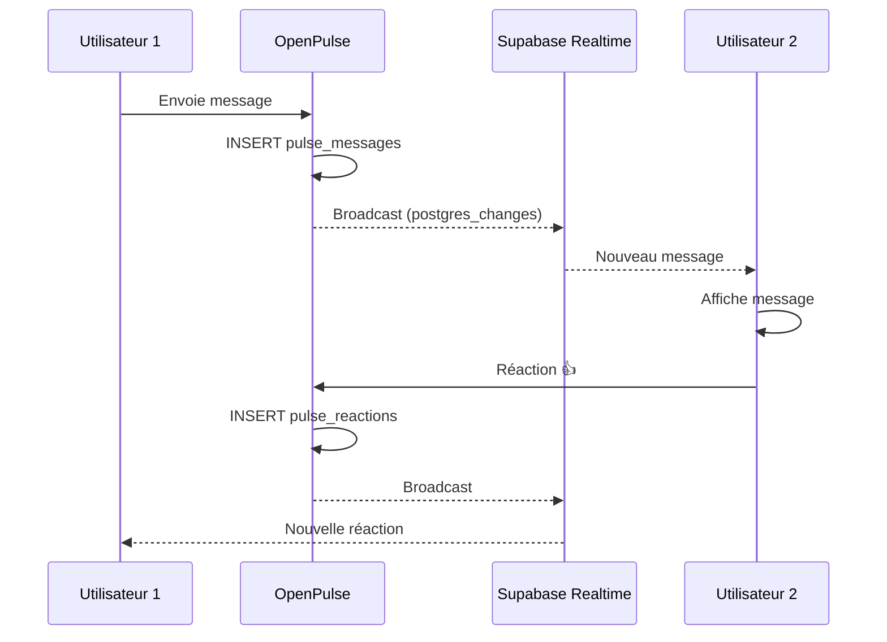

# Guide Technique - Module Pulse (Communication Interne)

> **Version**: 1.9.0 | **Dernière mise à jour**: Mars 2026

## Table des Matières

- [Vue d'ensemble](#vue-densemble)
- [Architecture](#architecture)
- [Composants](#composants)
- [Hooks](#hooks)
- [Tables de Base de Données](#tables-de-base-de-données)
- [Edge Functions](#edge-functions)
- [Temps Réel](#temps-réel)
- [IA Intégrée](#ia-intégrée)

---

## Vue d'ensemble

Pulse est le module de communication interne temps réel :

| Fonctionnalité | Description |
|----------------|-------------|
| **Conversations** | Discussions par équipe, projet, établissement |
| **Messages** | Texte, images, fichiers, mentions |
| **Sondages** | Création et vote en temps réel |
| **Recherche** | Recherche sémantique IA |
| **Notifications** | Push et in-app |
| **Visioconférence** | Intégration WebRTC |

---

## Architecture

```
┌─────────────────────────────────────────────────────────────┐
│                       PULSE MODULE                           │
├─────────────────────────────────────────────────────────────┤
│  Route: /pulse                                               │
├─────────────────────────────────────────────────────────────┤
│                                                              │
│  ┌───────────────────────────────────────────────────────┐  │
│  │                    Conversations                       │  │
│  │  ┌─────────┐  ┌─────────┐  ┌─────────┐              │  │
│  │  │ Équipe  │  │ Projet  │  │ Établ.  │              │  │
│  │  └─────────┘  └─────────┘  └─────────┘              │  │
│  └───────────────────────────────────────────────────────┘  │
│                          │                                   │
│                          ▼                                   │
│  ┌───────────────────────────────────────────────────────┐  │
│  │                     Messages                           │  │
│  │  • Texte riche (Tiptap)                               │  │
│  │  • Mentions @utilisateur                               │  │
│  │  • Pièces jointes                                      │  │
│  │  • Réactions emoji                                     │  │
│  │  • Threads de réponse                                  │  │
│  └───────────────────────────────────────────────────────┘  │
│                          │                                   │
│         ┌────────────────┼────────────────┐                 │
│         ▼                ▼                ▼                 │
│  ┌───────────┐  ┌───────────────┐  ┌───────────────┐       │
│  │ Sondages  │  │  Recherche IA │  │  Notifications │       │
│  └───────────┘  └───────────────┘  └───────────────┘       │
│                                                              │
│  ┌───────────────────────────────────────────────────────┐  │
│  │             Supabase Realtime (WebSocket)              │  │
│  └───────────────────────────────────────────────────────┘  │
└─────────────────────────────────────────────────────────────┘
```

---

## Composants

### Composants Principaux (`src/components/pulse/`)

| Composant | Description |
|-----------|-------------|
| `PulseDashboard.tsx` | Interface principale Pulse |
| `ConversationsList.tsx` | Liste des conversations |
| `ConversationView.tsx` | Vue d'une conversation |
| `MessageInput.tsx` | Éditeur de message (Tiptap) |
| `MessageItem.tsx` | Affichage d'un message |
| `MessageThread.tsx` | Thread de réponses |
| `PollCreator.tsx` | Création de sondage |
| `PollVote.tsx` | Interface de vote |
| `SearchPanel.tsx` | Recherche sémantique |
| `MembersList.tsx` | Participants conversation |
| `NotificationBell.tsx` | Badge notifications |

### Widgets Globaux

```tsx
// Badge non-lus dans sidebar
<PulseUnreadBadge />

// Widget derniers messages sur Dashboard
<PulseRecentWidget limit={5} />

// Bouton création rapide
<NewConversationButton />
```

---

## Hooks

| Hook | Description |
|------|-------------|
| `usePulseConversations` | Liste et CRUD conversations |
| `usePulseMessages` | Messages d'une conversation |
| `usePulseRealtime` | Abonnement temps réel |
| `usePulseSearch` | Recherche sémantique |
| `usePulsePolls` | Gestion sondages |
| `usePulseNotifications` | Notifications Pulse |
| `usePulseUnreadCount` | Compteur non-lus |

### Exemple d'utilisation

```typescript
import { usePulseMessages, usePulseRealtime } from '@/hooks/pulse';

function ConversationView({ conversationId }: { conversationId: string }) {
  const { 
    data: messages, 
    isLoading,
    sendMessage,
    editMessage,
    deleteMessage 
  } = usePulseMessages(conversationId);

  // Abonnement temps réel
  usePulseRealtime(conversationId, {
    onNewMessage: (message) => {
      // Rafraîchir la liste
    },
    onMessageEdited: (message) => {
      // Mettre à jour le message
    }
  });

  const handleSend = async (content: string) => {
    await sendMessage.mutateAsync({
      content,
      mentions: extractMentions(content)
    });
  };
}
```

---

## Tables de Base de Données

### `pulse_conversations`

```sql
CREATE TABLE pulse_conversations (
  id UUID PRIMARY KEY DEFAULT gen_random_uuid(),
  
  titre TEXT NOT NULL,
  description TEXT,
  
  type TEXT DEFAULT 'group', -- direct, group, channel
  
  -- Liaison optionnelle
  etablissement_id UUID REFERENCES etablissements,
  projet_id UUID REFERENCES rd_projets,
  
  -- Paramètres
  is_private BOOLEAN DEFAULT false,
  allow_reactions BOOLEAN DEFAULT true,
  allow_threads BOOLEAN DEFAULT true,
  
  -- Métadonnées
  avatar_url TEXT,
  last_message_at TIMESTAMPTZ,
  message_count INTEGER DEFAULT 0,
  
  created_by UUID REFERENCES profiles,
  created_at TIMESTAMPTZ DEFAULT now(),
  updated_at TIMESTAMPTZ DEFAULT now()
);
```

### `pulse_participants`

```sql
CREATE TABLE pulse_participants (
  id UUID PRIMARY KEY DEFAULT gen_random_uuid(),
  conversation_id UUID REFERENCES pulse_conversations NOT NULL,
  user_id UUID REFERENCES profiles NOT NULL,
  
  role TEXT DEFAULT 'member', -- admin, moderator, member
  
  -- Notifications
  muted BOOLEAN DEFAULT false,
  muted_until TIMESTAMPTZ,
  
  -- Lecture
  last_read_at TIMESTAMPTZ,
  unread_count INTEGER DEFAULT 0,
  
  joined_at TIMESTAMPTZ DEFAULT now(),
  
  UNIQUE(conversation_id, user_id)
);
```

### `pulse_messages`

```sql
CREATE TABLE pulse_messages (
  id UUID PRIMARY KEY DEFAULT gen_random_uuid(),
  conversation_id UUID REFERENCES pulse_conversations NOT NULL,
  
  author_id UUID REFERENCES profiles NOT NULL,
  
  -- Contenu
  content TEXT NOT NULL,
  content_html TEXT, -- Version HTML (Tiptap)
  
  -- Thread
  parent_message_id UUID REFERENCES pulse_messages,
  reply_count INTEGER DEFAULT 0,
  
  -- Mentions
  mentions UUID[] DEFAULT '{}',
  
  -- Édition
  is_edited BOOLEAN DEFAULT false,
  edited_at TIMESTAMPTZ,
  
  -- Suppression soft
  is_deleted BOOLEAN DEFAULT false,
  deleted_at TIMESTAMPTZ,
  
  created_at TIMESTAMPTZ DEFAULT now()
);
```

### `pulse_media`

```sql
CREATE TABLE pulse_media (
  id UUID PRIMARY KEY DEFAULT gen_random_uuid(),
  message_id UUID REFERENCES pulse_messages NOT NULL,
  
  type TEXT NOT NULL, -- image, file, video
  filename TEXT NOT NULL,
  mime_type TEXT,
  size_bytes INTEGER,
  
  storage_path TEXT NOT NULL,
  thumbnail_path TEXT,
  
  created_at TIMESTAMPTZ DEFAULT now()
);
```

### `pulse_reactions`

```sql
CREATE TABLE pulse_reactions (
  id UUID PRIMARY KEY DEFAULT gen_random_uuid(),
  message_id UUID REFERENCES pulse_messages NOT NULL,
  user_id UUID REFERENCES profiles NOT NULL,
  
  emoji TEXT NOT NULL, -- 👍, ❤️, 🎉...
  
  created_at TIMESTAMPTZ DEFAULT now(),
  
  UNIQUE(message_id, user_id, emoji)
);
```

### `pulse_polls`

```sql
CREATE TABLE pulse_polls (
  id UUID PRIMARY KEY DEFAULT gen_random_uuid(),
  message_id UUID REFERENCES pulse_messages NOT NULL,
  
  question TEXT NOT NULL,
  options JSONB NOT NULL, -- [{id, text, votes}]
  
  allows_multiple BOOLEAN DEFAULT false,
  anonymous BOOLEAN DEFAULT false,
  
  expires_at TIMESTAMPTZ,
  
  created_at TIMESTAMPTZ DEFAULT now()
);

CREATE TABLE pulse_poll_votes (
  id UUID PRIMARY KEY DEFAULT gen_random_uuid(),
  poll_id UUID REFERENCES pulse_polls NOT NULL,
  user_id UUID REFERENCES profiles NOT NULL,
  option_id TEXT NOT NULL,
  
  created_at TIMESTAMPTZ DEFAULT now(),
  
  UNIQUE(poll_id, user_id, option_id)
);
```

---

## Temps Réel

### Configuration Supabase Realtime

```typescript
// src/hooks/pulse/usePulseRealtime.ts
import { supabase } from '@/integrations/supabase/client';

export function usePulseRealtime(conversationId: string, callbacks: RealtimeCallbacks) {
  useEffect(() => {
    const channel = supabase
      .channel(`pulse:${conversationId}`)
      .on(
        'postgres_changes',
        {
          event: 'INSERT',
          schema: 'public',
          table: 'pulse_messages',
          filter: `conversation_id=eq.${conversationId}`
        },
        (payload) => {
          callbacks.onNewMessage?.(payload.new as PulseMessage);
        }
      )
      .on(
        'postgres_changes',
        {
          event: 'UPDATE',
          schema: 'public',
          table: 'pulse_messages',
          filter: `conversation_id=eq.${conversationId}`
        },
        (payload) => {
          callbacks.onMessageEdited?.(payload.new as PulseMessage);
        }
      )
      .subscribe();

    return () => {
      supabase.removeChannel(channel);
    };
  }, [conversationId]);
}
```

### Indicateur "En train d'écrire"

```typescript
// Présence Supabase
const channel = supabase.channel(`typing:${conversationId}`);

// Signaler qu'on écrit
channel.track({ user_id: currentUserId, typing: true });

// Écouter les autres
channel.on('presence', { event: 'sync' }, () => {
  const state = channel.presenceState();
  const typingUsers = Object.values(state).flat().filter(u => u.typing);
  setTypingUsers(typingUsers);
});
```

---

## Edge Functions

### `pulse-ai-chat`

Assistant IA dans les conversations.

```typescript
POST /functions/v1/pulse-ai-chat
{
  "conversationId": "uuid",
  "query": "Résume les derniers messages"
}

// Response
{
  "success": true,
  "response": "Les derniers échanges portent sur..."
}
```

### `pulse-search`

Recherche sémantique dans les messages.

```typescript
POST /functions/v1/pulse-search
{
  "query": "réunion budget janvier",
  "conversationIds": ["uuid1", "uuid2"]
}

// Response
{
  "success": true,
  "results": [
    {
      "messageId": "uuid",
      "conversationId": "uuid",
      "content": "...",
      "relevance": 0.92
    }
  ]
}
```

### `pulse-notify`

Envoi de notifications Pulse.

```typescript
POST /functions/v1/pulse-notify
{
  "type": "mention",
  "userId": "uuid",
  "messageId": "uuid",
  "conversationId": "uuid"
}
```

---

## IA Intégrée

### Fonctionnalités IA

| Fonctionnalité | Description |
|----------------|-------------|
| **Résumé** | Résumer une longue conversation |
| **Recherche sémantique** | Trouver des messages par sens |
| **Suggestions** | Proposer des réponses |
| **Traduction** | Traduire les messages |
| **Modération** | Détecter contenu inapproprié |

### Exemple: Résumé de Conversation

```typescript
// Bouton "Résumer" dans l'interface
const handleSummarize = async () => {
  const { data } = await supabase.functions.invoke('pulse-ai-summarize', {
    body: { conversationId, lastNMessages: 50 }
  });
  
  setSummary(data.summary);
};
```

---

## Workflow Type



---

*Documentation mise à jour en mars 2026 — v1.9.0*
