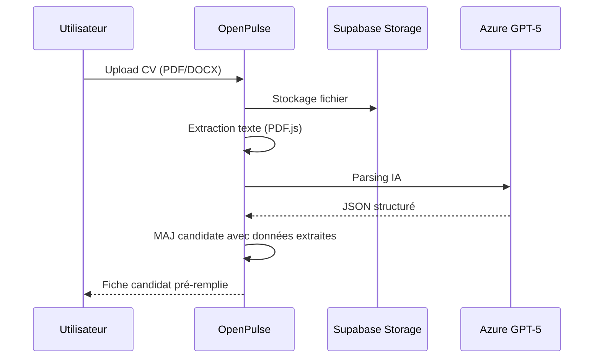

# Guide Technique - Module Recrutement

> **Version**: 1.9.0 | **Dernière mise à jour**: Mars 2026

## Table des Matières

- [Vue d'ensemble](#vue-densemble)
- [Architecture](#architecture)
- [Composants](#composants)
- [Hooks](#hooks)
- [Tables de Base de Données](#tables-de-base-de-données)
- [Edge Functions](#edge-functions)
- [Parsing CV IA](#parsing-cv-ia)

---

## Vue d'ensemble

Le module Recrutement gère le pipeline de candidature complet :

| Fonctionnalité | Description |
|----------------|-------------|
| **Offres d'emploi** | Publication et gestion des offres |
| **Candidatures** | Pipeline Kanban avec étapes configurables |
| **Documents** | CV, lettres de motivation, pièces |
| **Parsing IA** | Extraction automatique des informations CV |
| **Évaluations** | Grilles d'évaluation et notes |
| **Entretiens** | Planification et suivi |

---

## Architecture

```
┌─────────────────────────────────────────────────────────────┐
│                    RECRUTEMENT MODULE                        │
├─────────────────────────────────────────────────────────────┤
│  Routes: /recrutement, /recrutement/offres, /recrutement/candidats │
├─────────────────────────────────────────────────────────────┤
│                                                              │
│  ┌─────────────┐  ┌─────────────┐  ┌─────────────┐         │
│  │   Offres    │→→│ Candidatures│→→│ Évaluations │         │
│  │  d'emploi   │  │  (Pipeline) │  │ Entretiens  │         │
│  └─────────────┘  └─────────────┘  └─────────────┘         │
│         │                │                │                  │
│         ▼                ▼                ▼                  │
│  ┌─────────────────────────────────────────────────────┐   │
│  │               Pipeline Kanban                         │   │
│  │  [Nouveau] → [Présélection] → [Entretien] → [Offre]  │   │
│  └─────────────────────────────────────────────────────┘   │
│                          │                                   │
│                          ▼                                   │
│  ┌─────────────────────────────────────────────────────┐   │
│  │              IA Parsing CV (GPT-5)                    │   │
│  │  • Extraction compétences                             │   │
│  │  • Extraction expériences                             │   │
│  │  • Scoring adéquation                                 │   │
│  └─────────────────────────────────────────────────────┘   │
└─────────────────────────────────────────────────────────────┘
```

---

## Composants

### Composants Principaux (`src/components/recrutement/`)

| Composant | Description |
|-----------|-------------|
| `RecrutementDashboard.tsx` | Dashboard avec KPIs recrutement |
| `OffresList.tsx` | Liste des offres d'emploi |
| `OffreFormDialog.tsx` | Création/édition offre |
| `CandidatsList.tsx` | Liste des candidats |
| `CandidatDetail.tsx` | Fiche candidat détaillée |
| `CandidatPipeline.tsx` | Vue Kanban du pipeline |
| `CandidatCard.tsx` | Carte candidat draggable |
| `EvaluationForm.tsx` | Grille d'évaluation |
| `EntretienScheduler.tsx` | Planification entretien |
| `CVParser.tsx` | Interface parsing CV IA |

---

## Hooks

| Hook | Description |
|------|-------------|
| `useJobOffers` | CRUD offres d'emploi |
| `useCandidates` | CRUD candidats |
| `useCandidatePipeline` | Gestion pipeline Kanban |
| `useCandidateDocuments` | Documents candidat |
| `useCandidateEvaluations` | Évaluations |
| `useInterviews` | Entretiens |

### Exemple d'utilisation

```typescript
import { useCandidatePipeline } from '@/hooks/recrutement';

function CandidatPipeline({ offerId }: { offerId: string }) {
  const { 
    data: candidates, 
    moveCandidate,
    isLoading 
  } = useCandidatePipeline(offerId);

  const handleDragEnd = async (candidateId: string, newStage: string) => {
    await moveCandidate.mutateAsync({ candidateId, stage: newStage });
  };

  return (
    <DndContext onDragEnd={handleDragEnd}>
      {STAGES.map(stage => (
        <PipelineColumn key={stage} stage={stage}>
          {candidates?.filter(c => c.stage === stage).map(candidate => (
            <CandidatCard key={candidate.id} candidate={candidate} />
          ))}
        </PipelineColumn>
      ))}
    </DndContext>
  );
}
```

---

## Tables de Base de Données

### `job_offers`

```sql
CREATE TABLE job_offers (
  id UUID PRIMARY KEY DEFAULT gen_random_uuid(),
  
  titre TEXT NOT NULL,
  description TEXT,
  
  -- Détails du poste
  type_contrat TEXT, -- CDI, CDD, Stage, Alternance
  lieu TEXT,
  teletravail TEXT, -- full, hybrid, none
  salaire_min NUMERIC,
  salaire_max NUMERIC,
  
  -- Exigences
  experience_min INTEGER, -- années
  competences_requises TEXT[],
  competences_souhaitees TEXT[],
  
  -- Publication
  statut TEXT DEFAULT 'brouillon', -- brouillon, publiee, fermee, pourvue
  date_publication DATE,
  date_limite DATE,
  
  -- Métadonnées
  departement TEXT,
  responsable_id UUID REFERENCES profiles,
  
  created_at TIMESTAMPTZ DEFAULT now(),
  updated_at TIMESTAMPTZ DEFAULT now()
);
```

### `candidates`

```sql
CREATE TABLE candidates (
  id UUID PRIMARY KEY DEFAULT gen_random_uuid(),
  job_offer_id UUID REFERENCES job_offers,
  
  -- Informations personnelles
  prenom TEXT NOT NULL,
  nom TEXT NOT NULL,
  email TEXT NOT NULL,
  telephone TEXT,
  linkedin_url TEXT,
  
  -- Pipeline
  stage TEXT DEFAULT 'nouveau', -- nouveau, preselection, entretien1, entretien2, offre, embauche, refuse
  
  -- Parsing IA
  competences_extraites JSONB,
  experience_annees INTEGER,
  formation TEXT,
  score_adequation NUMERIC, -- 0-100
  
  -- Source
  source TEXT, -- site, linkedin, cooptation, cabinet
  referent TEXT,
  
  -- Notes
  notes TEXT,
  
  -- Dates
  date_candidature DATE DEFAULT CURRENT_DATE,
  date_derniere_action DATE,
  
  created_at TIMESTAMPTZ DEFAULT now(),
  updated_at TIMESTAMPTZ DEFAULT now()
);
```

### `candidate_documents`

```sql
CREATE TABLE candidate_documents (
  id UUID PRIMARY KEY DEFAULT gen_random_uuid(),
  candidate_id UUID REFERENCES candidates NOT NULL,
  
  type TEXT NOT NULL, -- cv, lettre_motivation, diplome, autre
  nom TEXT NOT NULL,
  storage_path TEXT NOT NULL,
  mime_type TEXT,
  taille_bytes INTEGER,
  
  -- Parsing
  is_primary BOOLEAN DEFAULT false,
  parsed_content JSONB,
  
  uploaded_by UUID REFERENCES profiles,
  created_at TIMESTAMPTZ DEFAULT now()
);
```

### `candidate_evaluations`

```sql
CREATE TABLE candidate_evaluations (
  id UUID PRIMARY KEY DEFAULT gen_random_uuid(),
  candidate_id UUID REFERENCES candidates NOT NULL,
  evaluator_id UUID REFERENCES profiles NOT NULL,
  
  -- Critères
  criteres JSONB NOT NULL, -- [{nom, note, commentaire}]
  note_globale NUMERIC,
  
  recommandation TEXT, -- embaucher, peut-etre, refuser
  commentaire TEXT,
  
  created_at TIMESTAMPTZ DEFAULT now()
);
```

### `candidate_interviews`

```sql
CREATE TABLE candidate_interviews (
  id UUID PRIMARY KEY DEFAULT gen_random_uuid(),
  candidate_id UUID REFERENCES candidates NOT NULL,
  
  type TEXT, -- telephone, visio, presentiel
  date_heure TIMESTAMPTZ NOT NULL,
  duree_minutes INTEGER DEFAULT 60,
  
  interviewers UUID[] NOT NULL,
  lieu TEXT,
  video_url TEXT,
  
  statut TEXT DEFAULT 'planifie', -- planifie, confirme, realise, annule
  
  notes TEXT,
  compte_rendu TEXT,
  
  calendar_event_id UUID REFERENCES calendar_events,
  
  created_at TIMESTAMPTZ DEFAULT now()
);
```

---

## Edge Functions

### `parse-cv-with-ai`

Parse un CV avec GPT-5 pour extraire les informations.

```typescript
POST /functions/v1/parse-cv-with-ai
{
  "documentId": "uuid",
  "jobOfferId": "uuid"  // optionnel, pour scoring adéquation
}

// Response
{
  "success": true,
  "parsed": {
    "nom": "Dupont",
    "prenom": "Jean",
    "email": "jean.dupont@email.com",
    "telephone": "06 12 34 56 78",
    "competences": ["Python", "React", "PostgreSQL"],
    "experiences": [
      {
        "poste": "Développeur Full Stack",
        "entreprise": "TechCorp",
        "duree_mois": 24,
        "description": "..."
      }
    ],
    "formations": [
      {
        "diplome": "Master Informatique",
        "etablissement": "Université Paris",
        "annee": 2020
      }
    ],
    "experience_totale_annees": 5,
    "score_adequation": 85
  }
}
```

### Paramètres GPT-5

```typescript
const azureResponse = await fetch(AZURE_OPENAI_ENDPOINT, {
  method: "POST",
  headers: {
    "Content-Type": "application/json",
    "api-key": AZURE_OPENAI_API_KEY,
  },
  body: JSON.stringify({
    messages: [
      { role: "system", content: CV_PARSING_SYSTEM_PROMPT },
      { role: "user", content: cvText }
    ],
    max_completion_tokens: 3000,
    reasoning_effort: "medium",
    verbosity: "medium",
    response_format: { type: "json_object" }
  }),
});
```

---

## Parsing CV IA

### Workflow



### Prompt Système

```typescript
const CV_PARSING_SYSTEM_PROMPT = `
Tu es un expert RH. Analyse ce CV et extrais les informations structurées.

Retourne un JSON avec :
- nom, prenom, email, telephone, linkedin
- competences: tableau de compétences techniques et soft skills
- experiences: tableau avec poste, entreprise, duree_mois, description
- formations: tableau avec diplome, etablissement, annee
- langues: tableau avec langue, niveau
- experience_totale_annees: nombre d'années d'expérience

Si une information n'est pas trouvée, utilise null.
`;
```

---

## Pipeline Stages

| Stage | Description | Actions |
|-------|-------------|---------|
| `nouveau` | Candidature reçue | Parsing CV, première lecture |
| `preselection` | Présélectionné | Évaluation CV, appel screening |
| `entretien1` | 1er entretien | Entretien RH/Manager |
| `entretien2` | 2ème entretien | Entretien technique/Direction |
| `offre` | Offre envoyée | Négociation, promesse d'embauche |
| `embauche` | Embauché | Onboarding RH |
| `refuse` | Refusé | Archivage, email de refus |

---

*Documentation générée en janvier 2026*
